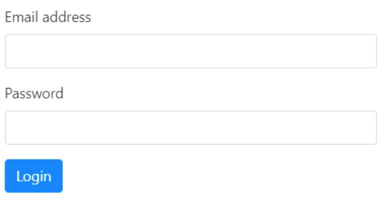

# My Developer Journey

My personal knowledge base. It's a bunch of QAs, documentation &amp; code snippets that I gathered along the way of  
becoming a software engineer.

- [My Developer Journey](#my-developer-journey)
  - [Angular](#angular)
    - [Angular - General](#angular---general)
      - [*What are directives in Angular?*](#what-are-directives-in-angular)
    - [Angular - Routing](#angular---routing)
    - [Angular - Forms](#angular---forms)
      - [*How do template based forms differ from reactive forms?*](#how-do-template-based-forms-differ-from-reactive-forms)
      - [How do template forms work in angular?](#how-do-template-forms-work-in-angular)
      - [How does two-way binding work in Angular Forms?](#how-does-two-way-binding-work-in-angular-forms)
      - [What is controle state in Angular forms?](#what-is-controle-state-in-angular-forms)

## Angular

### Angular - General  

---

#### *What are directives in Angular?*  

### Angular - Routing

---

### Angular - Forms

---

#### *How do template based forms differ from reactive forms?*  

#### How do template forms work in angular?

- A form is composed of a `<form>` tag that contains divs of the **form-group** class. Each form group contains a  
`<label>` and a `<input>` tag. Finally you have a submit button

```html
<form>
    <div class="form-group">
        <label></label>
        <input>
    </div>
    <button type="submit"></button>
</form>
```

- A form should have a  **template ref** variable that so we can refer to the form as a whole.  We assign this  
variable the value **ngForm** which is a directive [See Official Angular Documentation on Directives](https://angular.io/guide/attribute-directives)

```html
<form #formName="ngForm">
```

- Every `<input>`tag has to have a name attribute which is used as the field's key on submission.  

```html
<input name="fieldName">
```  

- Input tags need an event listener, ngModel. It's used to encapsulate other event such as key presses and focus,  
blur, etc (anything that has to do with input control).  We give it a placeholder value that we'll use later on in  
the form data.  

```html
<input (ngModel)="model.fieldName">
```  

- To submit a form you need to add a (ngSubmit) event listener to the `<form>` tag. We assign it to the method that  
we want to call when submitting the form and pass the **template ref variable** value of the form to it (it's an  
object container key value pairs of the fields and the submitted values).

```html
<form (ngSubmit)=methodName(templateRefName.value)>

```

- The final product would look something like the following (for an example login form):

```html
<form #loginForm="ngForm" (ngSubmit)="login(loginForm.value)">
    <div class="form-group">
        <label for="emailAddress">Email</label>
        <input name="emailAddress" (ngModel)="model.emailAddress" type="email" class="form-control" id="emailAddress">

        <label for="password">Password</label>
        <input name="password"  (ngModel)="model.password" type="password" class="form-control" id="password">
    </div>
    <button type="submit" class="btn btn-primary"></button>
</form>

```

<p align="left" style="padding-left:60px;">

</p>

#### How does two-way binding work in Angular Forms?

- Two way binding allows child and parent components to share data by listening and changing the values simulatneously.
- This is done using the inputChange pattern where input is the name of the @Input property in the child component and 
the @Output event emitter is assigned to inputChange.

```typescript
export class SizerComponent {

@Input()  size!: number | string;
@Output() sizeChange = new EventEmitter<number>();

dec() { this.resize(-1); }
inc() { this.resize(+1); }

resize(delta: number) {
    this.size = Math.min(40, Math.max(8, +this.size + delta));
    this.sizeChange.emit(this.size);
    }
}
```

- Inside the parent component you will listen to changes to the fontSizePx property using the [(size)]="fontSizePx"
binding which is a property AND event binding.

```html
    <app-sizer [(size)]="fontSizePx"></app-sizer>
    <app-sizer [size]="fontSizePx" (sizeChange)="fontSizePx=$event"></app-sizer>
    THE TWO ABOVE LINES ARE EQUIVALENT
    <div [style.font-size.px]="fontSizePx">Resizable Text</div>
```

- [Stack Blitz Demo](https://stackblitz.com/edit/angular-ivy-q95zif?file=src/app/app.component.html)
- Inside forms two way binding can be used to display data as it's being modified within the form using the ngModel
directive. [ngModel Official documentation](https://angular.io/guide/built-in-directives#ngModel)
- In the below code the interpolation of {{model.emailAddress}} will update in real time as you type into the email
input field

```html
<label for="emailAddress">Email</label>
<input name="emailAddress" [(ngModel)]="model.emailAddress" type="email" class="form-control" id="emailAddress">
{{model.emailAddress}}
```

#### What is controle state in Angular forms?

- Each input form control and the form itself are assigned one value from three pairs
  - Pristine / Dirty
  - Touched / Untouched
  - Valid / Invalid
- These states will control which class are assigned to the html tags of those form controls.
  - ng-pristine/ng-dirty
  - ng-touched/ng-untouched
  - ng-valide/ng-invalid
- In the template this will be reflected as below:

```html
<input ... class="form-control ng-untouched ng-pristine ng-valid" id="emailAddress">
```

- The default for each form-control is pristine and untouched and those will flip once the element's value is changed  
or was focused/unfocused. The valid/invalid will depend on the presence of validation rules such as the required  
field.

```html
<input ... required class="form-control" id="emailAddress">
```

- You can control the look of form control element through css tied to the classes or directives (display popus  
for example).  This is done by created an element ref variable on the input and assigning it to ngModel

```html
<input ... required #nameModel="ngModel" ngclass="form-control" id="emailAddress">
{{ngModel.valid}} //invalid if nothing is in the field, ng-invalid css could be {border: solid 3px red}
```
