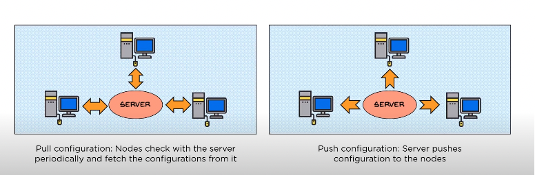

# Ansible

- what is ansible?
  - configuration and orchestration for IT assets
  - uses a YAML file to describe the verious playbook?
- why ansible?
  - you can write code that describes the state that you want you assets to be in and thus create automated ways of managing
  large sets of servers.
- how do you install ansible?
  - on most UNIX style machines you can install ansbile from pypi. However on some distributions you can use other package
  managers


```shell
# Most scenarios
python3 -m pip install --user ansible

# On Fedora
sudo dnf install ansible 

# On CentOS
sudo yum install epel-release
sudo yum install ansible

# On Ubuntu
sudo apt install software-properties-common
sudo apt install add-app-repository --yes --update ppa:ansible/ansible
sudo apt install ansible
```

- what is a playbook in ansible?
  - it a fancy way of saying a collection of configuration files used by ansible. they are written in YAML

```YAML
---
- name: [playbook_name]
  hosts: [host_group_name_from_inventory]
  remote_user: root
  become: true (flag to show that its a priviliged access)
  tasks:
    - name: install httpd
      yum:
        name: http
        state: latest
    - name: run httpd
      service:
            name: httpd
            state: started
    - name: create content
      copy:
        content: /some/path/to/file
        dest: /var/www/html/index.html 
```

- how do you check the syntax of a playbook?

```shell
ansible-playbook sample.yml --syntax-check
```

- how to run a specific command on nodes?

```shell
ansible linux -a "cat /etc/os-release"
```

- how do you run a playbook?

```shell
ansible-playbook sample.yml
```

- what are the common tasks that can be accomplished with ansible?
- how are the benefits of ansible measure?
- how does ansible communicate with the nodes from the master?
  - ansible uses ssh to communicate with the nodes?
- what does it mean to be a push configuration tool?
  - push based configuration management means that you don't have to install an agent on each node.
  - an agent is a small software that runs on every node that needs to be managed and at regular interval will **pull**
  the configs from the server. If there is a discrepancy then the new version of configs will be applied. Cheff and Puppet
  are examples of such systems.
  - on push based config management tools the server will send the configs to the nodes



- what is an inventory in ansible and how is it configured?
  - its a list of hosts ansible will mananage the config for. It can be in INI or YAML format and can be organised into
  different sub-groups. The list can be an IP address or a FQDN (fully qualified domain name)

```INI
#INI format
[webservers]
hostname.domain.com

[dbservers]
192.168.1.100
```

- what is the architecture ansible:
  - local machine, where ansible is installed
  - modules which are configuration files. each module consists of palybooks
  - invetory, a list of nodes to control
  - each node is connected to via ssh clients


## Ansible Playbooks

- A playbook enables us to take our group of servers and perform configuration and installation tasks against that group
- Their structure looks like the following: Playbook > Plays > Tasks
- They're written in YAML format

```yaml
- name: Simple Play
  hosts: localhost
  connection: local
  tasks:
    - name: Ping me
      ping:
    - name: print os
      debug:
        msg: "{{ ansible_os_family }}"
```

## Ansible Galaxy & Roles

roles are used to group different groups of assets into categories that are similar and share common tasks (webservers/loadbalanceers...)

This is done using the ansible-galaxy command which created a file structure that will house the different yaml files:

```shell
root@ansible-vm-1:~# ansible-galaxy init roles/webservers
- Role roles/webservers was created successfully
root@ansible-vm-1:~# tree
├── playbook.yml
├── roles
│   └── webservers
│       ├── README.md
│       ├── defaults
│       │   └── main.yml
│       ├── files
│       ├── handlers
│       │   └── main.yml
│       ├── meta
│       │   └── main.yml
│       ├── tasks
│       │   └── main.yml
│       ├── templates
│       ├── tests
│       │   ├── inventory
│       │   └── test.yml
│       └── vars
│           └── main.yml

[ansible_architecture](../assets/ansible/ansible_architecture.png)

- How does variable interpolation work in ansible?
  - Through the jinja template style of {{ variable_name }}
- How to run tasks conditionally?
  - We use the "when" field in the task

```yml
tasks:
  - name: "shut down Debian flavoured systems"
    command: /sbin/shutdown -t now
    when: ansible_os_family == "Debian"
```

- what is the difference between handlers and tasks in ansible?
  - handlers are just a special type of task that only run when they are triggered by the "notified" directive
  - in the below example you can see that the ansible playbook only runs a task to write to teh index.html file if
  the apache service got restarted

```yaml
- name: write a basic index.html file
  template:
    src: templates/index.html.j2
    dest: /var/www/html/index.html
  notify:
  - restart apache
```

### How to tydi up a playbook

You can split a playbook into folders for handlers, tasks and templates and have it reference yaml files in those
folder that will contain the various components of the playbook.

The below structure is a usefull example.

```shell
root@ansible-vm-1:~/ansible_sandbox/scenario2# tree
.
├── handlers
│   └── main.yml
├── playbook2.yml
├── tasks
│   └── apache2_install.yml
└── templates
    ├── index.html.j2
    └── ports.conf.j2

3 directories, 5 files
```

The playbook2.yml file would import tasks using the below syntax:

```yaml
- hosts: linux
  become: yes
  vars:
    http_port: 8000
    https_port: 4443
    html_welcome_msg: "Hello 90DaysOfDevOps - Welcome to Day 66!"
  tasks:
  - import_tasks: tasks/apache2_install.yml

  handlers:
  - import_tasks: handlers/main.yml
```

In scanrios where we have more specific functions for each server (loadbalancer, database servers...) we can use
ansible-galaxy to create roles and manage them in shared repositories

```shell
root@ansible-vm-1:~/ansible_sandbox/scenario3# ansible-galaxy init roles/apache2
- Role roles/apache2 was created successfully
root@ansible-vm-1:~/ansible_sandbox/scenario3# tree
.
└── roles
    └── apache2
        ├── README.md
        ├── defaults
        │   └── main.yml
        ├── files
        ├── handlers
        │   └── main.yml
        ├── meta
        │   └── main.yml
        ├── tasks
        │   └── main.yml
        ├── templates
        ├── tests
        │   ├── inventory
        │   └── test.yml
        └── vars
            └── main.yml

10 directories, 8 files
```

The playbook will import the roles instead of the tasks (as compared to playbook2).

```yaml
- hosts: linux
  become: yes
  vars:
    http_port: 8000
    https_port: 4443
    html_welcome_msg: "Hello 90DaysOfDevOps - Welcome to Day 66! This new version comes from ansible-galaxy"
  roles:
    - apache2
```

We'll create some more role for all servers (common) and load balancer (ngix)


```shell
root@ansible-vm-1:~/ansible_sandbox/scenario3# ansible-galaxy init roles/common
- Role roles/common was created successfully
root@ansible-vm-1:~/ansible_sandbox/scenario3# ansible-galaxy init roles/ngix
- Role roles/ngix was created successfully
root@ansible-vm-1:~/ansible_sandbox/scenario3# tree
.
├── playbook3.yml
└── roles
    ├── apache2
    │   ├── README.md
    │   ├── defaults
    │   │   └── main.yml
    │   ├── files
    │   ├── handlers
    │   │   └── main.yml
    │   ├── meta
    │   │   └── main.yml
    │   ├── tasks
    │   │   ├── apache2_install.yml
    │   │   └── main.yml
    │   ├── templates
    │   │   ├── index.html.j2
    │   │   └── ports.conf.j2
    │   ├── tests
    │   │   ├── inventory
    │   │   └── test.yml
    │   └── vars
    │       └── main.yml
    ├── common
    │   ├── README.md
    │   ├── defaults
    │   │   └── main.yml
    │   ├── files
    │   ├── handlers
    │   │   └── main.yml
    │   ├── meta
    │   │   └── main.yml
    │   ├── tasks
    │   │   └── main.yml
    │   ├── templates
    │   ├── tests
    │   │   ├── inventory
    │   │   └── test.yml
    │   └── vars
    │       └── main.yml
    └── ngix
        ├── README.md
        ├── defaults
        │   └── main.yml
        ├── files
        ├── handlers
        │   └── main.yml
        ├── meta
        │   └── main.yml
        ├── tasks
        │   └── main.yml
        ├── templates
        ├── tests
        │   ├── inventory
        │   └── test.yml
        └── vars
            └── main.yml

28 directories, 28 **files**
```

## Tags in Ansible

- As playbooks get biggert and we only want certain parts of them to be run in some cases, we can ascribe tags to sections
of the playbook using tags.

- In the below example we add a tag in the playbook for the loadbalancer plays.

```yaml
- hosts: loadbalancers
  become: yes
  roles:
    - common
    - nginx
  tags: loadbalancer
```

- We can list the tags in a play book using the below command

```shell
root@ansible-vm-1:~/ansible_sandbox/scenario5# ansible-playbook playbook5.yml --list-tags

playbook: playbook5.yml

  play #1 (webservers): webservers      TAGS: []
      TASK TAGS: []

  play #2 (loadbalancers): loadbalancers        TAGS: [loadbalancer]
      TASK TAGS: [loadbalancer]
```

- To run specific sections of the playbook we can specify the tags that we want to target

```shell
ansible-playbook playbook5.yml --tags proxy
```

- Some task can be specified to run no matter what tags are specified in the playbook run command using the tag:always field
in that task's section of the playbook.

- You can bundle multiple tags together to be run with this syntax
  - --tags proxy,web

## Variables

- As infrastructure grows you would want to dynamicaly generate automation files which is where variables come into play.
There are two types:
  - User Created
  - Ansible Facts

### Ansible Facts

- Using the command ansible [host_group_name] -m setup. You get a long JSON output that details everything about the 
machines in that group.

- The ansible facts and jinja2 templating can be used to create dynamic for loops that interpolate facts as needed without
  manualy hardcoding
  - In the below example we're configuring the nginx proxies dynamically. It will look for each node in the webserver
  group and interpolate the nodename as an upstream server.

```jinja
#Dynamic Config for server {{ ansible_facts['nodename'] }}
    upstream webservers {
  
        server {{ hostvars[host]['ansible_facts']['nodename'] }}:8000;
    
    }

    server {
        listen 80;

        location / {
                proxy_pass http://webservers;
        }
    }
```

### User Created

- User generated variables are what we've seen previously in the playbook files, such as the http_port and html_welcome_msg.
- However we can cleanup the file structure and let those variables be accessed dynamically
- We'll create a a file under groups_vars/all/common_variables.yml and move the following variables into it

```yaml
http_port: 8000
https_port: 4443
html_welcome_msg: "Hello 90DaysOfDevOps - Welcome to Day 68!"
```

- Now our playbook looks like this

```yaml
- hosts: webservers
  become: yes
  roles:
    - common
    - apache2
  tags: web

- hosts: proxy
  become: yes
  roles:
    - common
    - nginx
  tags: proxy
```

- We can now use those variables in mysite.j2 to configure out nginx proxy

```jinja2
#Dynamic Config for server {{ ansible_facts['nodename'] }}
    upstream webservers {
  
        server {{ hostvars[host]['ansible_facts']['default_ipv4']['address'] }}:{{ http_port }};
    
    }

    server {
        listen 80;

        location / {
                proxy_pass http://webservers;
        }
    }
```

- We also modify the index.html of under roles/apache2/templates/index.html.j2 so that we know which node is serving us
  the page from behind the loadbalancer.

```html
<html>

<h1>{{ html_welcome_msg }}! I'm webserver {{ ansible_facts['nodename'] }} </h1>

</html>
```
