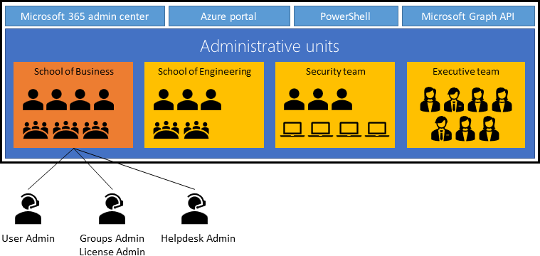
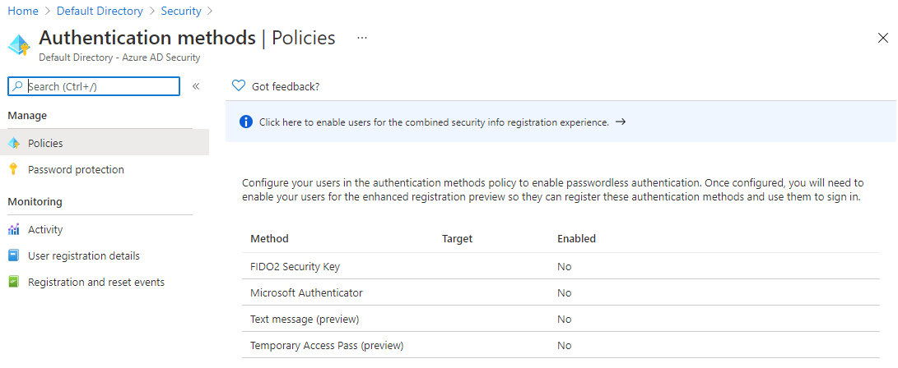
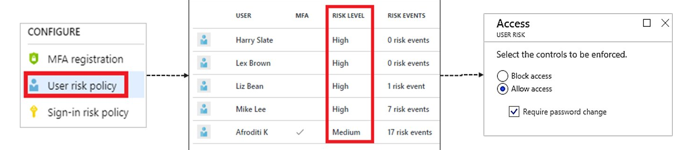
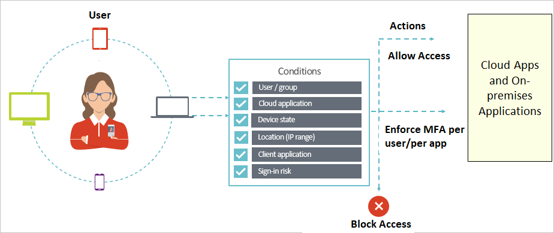
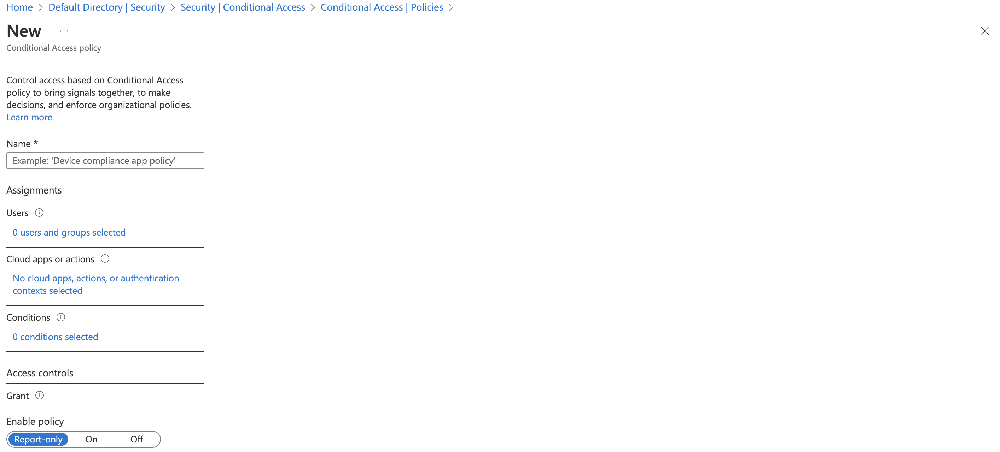

# Azure
<!-- markdownlint-disable MD025 -->
- [Azure](#azure)
- [Microsoft Certified: Azure Security Engineer Associate link](#microsoft-certified-azure-security-engineer-associate-link)
  - [AZ-500: Manage Identity and Access link](#az-500-manage-identity-and-access-link)
    - [Secure Azure solutions with Azure Active Directory](#secure-azure-solutions-with-azure-active-directory)
      - [Introduction](#introduction)
      - [Comparison of Azure Active Directory and Azure Active Directory Domain Services](#comparison-of-azure-active-directory-and-azure-active-directory-domain-services)
      - [Roles in Azure AD](#roles-in-azure-ad)
      - [Groups in Azure AD](#groups-in-azure-ad)
      - [Administrative Units in Azure AD](#administrative-units-in-azure-ad)
        - [Azure AD Admin Unit Roles](#azure-ad-admin-unit-roles)
      - [Passwordless Authentication](#passwordless-authentication)
    - [Implement Hybrid identity](#implement-hybrid-identity)
      - [Azure AD Connect](#azure-ad-connect)
      - [Authentication options](#authentication-options)
      - [Configure Password Hash Synchronization (PHS)](#configure-password-hash-synchronization-phs)
      - [Implement Pass-through Authentication (PTA)](#implement-pass-through-authentication-pta)
      - [Deploy Federation with Azure AD](#deploy-federation-with-azure-ad)
      - [Authentication decision tree](#authentication-decision-tree)
      - [Configure password writeback](#configure-password-writeback)
    - [Deploy Azure AD identity protection](#deploy-azure-ad-identity-protection)
      - [Identity Protection policies](#identity-protection-policies)
      - [Configuring risk event detections](#configuring-risk-event-detections)
      - [Implement user risk policy](#implement-user-risk-policy)
      - [Implement sign-in risk policy](#implement-sign-in-risk-policy)
      - [Deploy multi-factor authentication](#deploy-multi-factor-authentication)
      - [Azure AD conditional access](#azure-ad-conditional-access)
      - [Configuring conditional access conditions](#configuring-conditional-access-conditions)
  - [AZ-500: Implement platform protection](#az-500-implement-platform-protection)
  - [AZ-500: Secure your data and applications](#az-500-secure-your-data-and-applications)
  - [AZ-500: Manage security operation](#az-500-manage-security-operation)
- [Microsoft Certified: Cybersecurity Architect Expert link](#microsoft-certified-cybersecurity-architect-expert-link)
- [Service Bus](#service-bus)
  - [*What is azure service bus?*](#what-is-azure-service-bus)
  - [*How do message sessions work in azure service bus?*](#how-do-message-sessions-work-in-azure-service-bus)

---

# Microsoft Certified: Azure Security Engineer Associate [link](https://learn.microsoft.com/en-us/certifications/azure-security-engineer/?tab=tab-learning-paths)

## AZ-500: Manage Identity and Access [link](https://learn.microsoft.com/en-us/training/paths/manage-identity-access/)

### Secure Azure solutions with Azure Active Directory

#### Introduction

Microsoft Active Directory (Azure Ad) is Microsoft's cloud-based identity/access management service which allows users
login and access ressources.

Azure AD comes in four versions:

1. Free : Included with all Azure subscriptions. Provides user/group management, on-premise synchronisation, basic reports
and single sign-on.
2. Microsoft 365 Apps: Included with O365. It additionally includes identity mangement for MS 365 apps, group access management
and self-service password resets for cloud users.
3. Premium P1: Lets on-prem users access both on-prem and cloud ressources, support advanced admin (dynamic group, self service
group managment)
4. Premium P2: In addition to free and P1 features offers risk-based conditional access, priviliged indentity management
(monitor and report on admin access) as well as just-in-time access when needed.

#### Comparison of Azure Active Directory and Azure Active Directory Domain Services

| Active Directory                                       | Active Directory Dmain Services  |
| ------------------------------------------------------ | -------------------------------- |
| Cloud                                                  | On-prem                          |
| Deisgned for HTTP/HTTPS                                | Query via LDAP                   |
| Queried via REST API                                   | Uses Kerberos for Authentication |
| Uses SAML, WS-Federation, or OpenID for authentication | No Federated Services            |
| Uses OAuth for authorization                           | Organizational Units (OU's)      |
| Includes federation services                           | Group Policy (GPO's)             |

#### Roles in Azure AD

Global Admins can read/write all setting in AD which is why it's important to limit the number of people who have such access.
It is possible to designate limited admins to manage identity taasks in less privileged roles.

In cases where the organisation has more than 5 global admins it is recommended that admin get assigned more specific
priviliges using targerted role. These roles can be any of the below:

- **Application Administrator** - Users in this role can create and manage all aspects of enterprise applications,
application registrations, and application proxy settings.
- **Application Developer** - Can create application registrations independent of the 'Users can register applications' setting.
- **Authentication Administrator** - Users with this role can set or reset any authentication method (including passwords)
for non-administrators and some roles. Authentication Administrators can require users who are non-administrators or
assigned to some roles to re-register against existing non-password credentials (for example, multi-factor authentication
or Fast Identity Online), and can also revoke remember multi-factor authentication on the device, which prompts for
multi-factor authentication on the next sign-in.
- **Azure DevOps Administrator** - Users with this role can manage the Azure DevOps policy to restrict new Azure DevOps
organization creation to a set of configurable users or groups.
- **Azure Information Protection Administrator** - Users with this role have all permissions in the Azure Information
Protection service.
- **B2C User Flow Administrator** - Users with this role can create and manage B2C User Flows (also called "built-in"
policies) in the Azure portal.
- **B2C User Flow Attribute Administrator** - Users with this role add or delete custom attributes available to all user
flows in the tenant.
- **B2C IEF Keyset Administrator** - User can create and manage policy keys and secrets for token encryption, token
signatures, and claim encryption/decryption.
- **B2C IEF Policy Administrator** - Users in this role can create, read, update, and delete all custom policies in Azure
AD B2C and therefore have full control over the Identity Experience Framework in the relevant Azure AD B2C tenant.
- **Billing Administrator** - Makes purchases, manages subscriptions, manages support tickets, and monitors service health.
- **Cloud Application Administrator** - Users in this role have the same permissions as the Application Administrator role,
excluding the ability to manage application proxy.
- **Cloud Device Administrator** - Users in this role can enable, disable, and delete devices in Azure AD and read Windows
10 BitLocker keys (if present) in the Azure portal.
- **Compliance Administrator** - Users with this role have permissions to manage compliance-related features in the
compliance portal Microsoft Purview compliance portal, Microsoft 365 admin center, Azure, and Microsoft 365 Security &
compliance portal Microsoft Purview compliance portal.
- **Compliance Data Administrator** - Users with this role have permissions to track data in the compliance portal Microsoft
Purview compliance portal, Microsoft 365 admin center, and Azure. Users can also track compliance data within the
Exchange admin center,
- **Conditional Access Administrator** - Users with this role have the ability to manage Azure Active Directory Conditional
Access settings
- **Exchange Administrator** - Users with this role have global permissions within Microsoft Exchange Online when the
service is present.
- **Directory Readers** - Users in this role can read basic directory information.
- **Global Administrator / Company Administrator** - Users with this role have access to all administrative features in
Azure Active Directory, as well as services that use Azure Active Directory identities like Microsoft 365 security
center, Microsoft 365 compliance portal Microsoft Purview compliance portal, Exchange Online, SharePoint Online, and
Skype for Business Online.
- **Groups Administrator** - Users in this role can create/manage groups and its settings like naming and expiration policies.
- **Security Administrator** - Users with this role have permissions to manage security-related features in the Microsoft
365 security center, Azure Active Directory Identity Protection, Azure Information Protection, and Microsoft 365
Security & Compliance Center.

#### Groups in Azure AD

There are two types of groups in Azure AD, Security groups and Microsoft 365 groups:

- **Security groups** : The most common type, used to apply security policies for entire groups
- **Microsoft 365 groups** : Provide collaboration opportunity to a set of users by through access to shared mailboxes,
calendar, SharePoint sites. This option allows you to add people outside you organization.

There are different ways you can assign group access:

- **Assigned** : Add specific users to group.
- **Dynamic User** : Add users automatically depending on member's attributes.
- **Dynamic Device (Security Groups Only)** : Add and remove devices depending on device attributes.

#### Administrative Units in Azure AD

[Admin Units - MS Documentation](https://learn.microsoft.com/en-us/azure/active-directory/roles/administrative-units)

Administrative units are Azure AD ressources that can be containers for other ressources. They restrict the persmission
in a role to any portion of the organization that you define. They are used in organization where there are multiple
independent division. The admin of a given division will have scopes limited to the users of that division.

##### Azure AD Admin Unit Roles
<!-- markdownlint-disable MD013 -->
| Role                         | Description                                                                                                                                |
| ---------------------------- | ------------------------------------------------------------------------------------------------------------------------------------------ |
| Authentication Administrator | Has access to view, set, and reset authentication method information for any non-admin user in the assigned administrative unit only.      |
| Groups Administrator         | Can manage all aspects of groups and groups settings, such as naming and expiration policies, in the assigned administrative unit only.    |
| Helpdesk Administrator       | Can reset passwords for non-administrators and Helpdesk administrators in the assigned administrative unit only.                           |
| License Administrator        | Can assign, remove, and update license assignments within the administrative unit only.                                                    |
| Password Administrator       | Can reset passwords for non-administrators and Password Administrators within the assigned administrative unit only.                       |
| User Administrator           | Can manage all aspects of users and groups, including resetting passwords for limited admins within the assigned administrative unit only. |
<!-- markdownlint-enable MD013 -->

#### Passwordless Authentication

- **Windows Hello for Business** - biometric and PIN credentials are directly tied to the user's PC, which prevents
access from anyone other than the owner.
- **FIDO2 Security Keys** - generally stored on a USB stick, FIDO2 security keys are an unphishable standards-based passwordless
authentication method that can come in any form factor.
- **Microsoft Authenticator App** - Authenticator App turns any iOS or Android phone into a strong, passwordless credential.
Users can sign in to any platform or browser by getting a notification to their phone, matching a number displayed on
the screen to the one on their phone, and then using their biometric (touch or face) or PIN to confirm.
- **FIDO2 Smartcards (preview)** - new method to use FIDO2 keys for passwordless login via a smartcard.
Temporary Access Pass (preview) - time-limited passcode allows you to set up security keys and the Microsoft
Authenticator without ever needing to use, much less know, your password!

### Implement Hybrid identity

#### Azure AD Connect

Azure AD Connect allows you to synchronise your on-prem directories with Azure AD and thus provide a common identity
for you users.

- **Password hash synchronization** A sign-in method that synchronizes a hash of a users on-premises AD password with
Azure AD.
- **Pass-through authentication** A sign-in method that allows users to use the same password on-premises and in the
cloud, but doesn't require the additional infrastructure of a federated environment.
- **Synchronization** Responsible for creating users, groups, and other objects. As well as, making sure identity
information for your on-premises users and groups is matching the cloud. This synchronization also includes password hashes.

#### Authentication options

- Cloud Authenication
  - **Option 1: Azure AD password hash synchronization** : Users can use the same username and password that they use
on-premises without having to deploy any additional infrastructure.
  - **Option 2: Azure AD Pass-through Authentication** : Provides a simple password validation for Azure AD authentication
  services by using a software agent that runs on one or more on-premises servers. The servers validate the users
  directly with your on-premises Active Directory, which ensures that the password validation doesn't happen in the cloud.
- Federated Authentication
  - Azure AD hands off the authentication process to a separate trusted authentication system, such as on-premises
  Active Directory Federation Services (AD FS), to validate the user’s password.

#### Configure Password Hash Synchronization (PHS)

PHS is a feature that synchronises the passwords on-prem with the cloud. The password is taken from on-prem servers encrypts
it and sends it to the cloud as a has string. Azure then decrypts it and stores it as a user attribute in Azure AD.

When a user signs in to an Azure ressource using their on-prem password, Azure will compare the user's password hash against
that user's password hash in AD.

It is important to note that this is **same sign-in** and NOT **single sign-on**, the user is still authenitication against
two different directories.

#### Implement Pass-through Authentication (PTA)

When users sign-in using Azure AD, Pass-through authentication validates the users’ passwords directly against an organization's
on-premise Active Directory.

#### Deploy Federation with Azure AD

Federation is a collection of domains that have established trust. You can federate your on-premises environment with
Azure AD and use this federation for authentication and authorization. This sign-in method ensures that all user authentication
occurs on-premises. This method allows administrators to implement more rigorous levels of access control.

#### Authentication decision tree

#### Configure password writeback

Password writeback is a feature in Azure AD that allows users to reset password in the cloud and have that change reflected
in their on-prem directories. It can enforce on-prem password rules, is synchronous (no delay) and doesn't require any
outbound firewall rules (uses Azure Service Bus to communicate outbound over port 443).

### Deploy Azure AD identity protection

Identity Protection is a tool that allows organizations to automate the detection and remediation of identity-based risks.

- Creating access reviews to check on how each identity is being used and that the correct rights are assigned.
- Configure policies to identify risky user behaviors and odd sign-in patterns.
- Control and manage access to resources with conditional access policies.

#### Identity Protection policies

Identity Protection includes three default policies that admin can choose to enable.

- Multi-Factor authentication registration policy
  - Ensures new users sign up for MFA at registration
- Sign-in risk policy
  - Each sign-in event creates signales which Identity Protection will calculate a risk score from. These scores can be
  used by admins to decide wether to grant/block access or require MFA.
- User risk remediation policy

#### Configuring risk event detections

 Azure AD Identity Protection policies can automatically block a sign-in attempt or require additional action, such as
 requiring a password change or prompt for Azure AD Multi-Factor Authentication.

Some of the following actions may trigger Azure AD Identity Protection risk detection:

- Users with leaked credentials.
- Sign-ins from anonymous IP addresses.
- Impossible travel to atypical locations.
- Sign-ins from infected devices.
- Sign-ins from IP addresses with suspicious activity.

You can choose to turn the policy enforcement on or off, select users or groups for the policy to apply to, and decide
if you want to block access at sign-in or prompt for additional action.

- ***User risk policy*** - Identifies and responds to user accounts that may have compromised credentials. Can prompt
the user to create a new password.
- **Sign-in risk policy** - Identifies and responds to suspicious sign-in attempts. Can prompt the user to provide
additional forms of verification using Azure AD Multi-Factor Authentication.
- **MFA registration policy** - Makes sure users are registered for Azure AD Multi-Factor Authentication. If a sign-in
risk policy prompts for MFA, the user must already be registered for Azure AD Multi-Factor Authentication.

#### Implement user risk policy

Identity Protection can calculate what it believes is normal for a user's behavior and use that to base decisions for
their risk. User risk is a calculation of probability that an identity has been compromised.

With the information provided by the risky users report, administrators can find:

- Which users are at risk, have had risk remediated, or have had risk dismissed?
- Details about detections
- History of all risky sign-ins
- Risk history

Administrators can then choose to act on these events. Administrators can choose to:

- Reset the user password
- Confirm user compromise
- Dismiss user risk
- Block user from signing in
- Investigate further using Azure ATP (Azure Advanced Threat Detection, now known as Azure Defender)

#### Implement sign-in risk policy

Sign-in risk represents the probability that a given authentication request isn't authorized by the identity owner. It
supports the following conditions:

- Location
- Client apps
- Risky sign-ins

#### Deploy multi-factor authentication

The security of MFA two-step verification lies in its layered approach. Compromising multiple authentication factors presents
a significant challenge for attackers. Even if an attacker manages to learn the user's password, it is useless without
also having possession of the additional authentication method. Authentication methods include:

- Something you know (typically a password)
- Something you have (a trusted device that is not easily duplicated, like a phone)
- Something you are (biometrics)

MFA Options:

- Call to phone
- Text to phone
- Notification through mobile app
- Verification code from mobile ap

#### Azure AD conditional access

Conditional Access is at the heart of the new identity driven control plane. Using attributes that we know about users
(location, device, application) we can compute risk scores and those will determine if access is granted. They can be
though of as if-then statements and they are triggerd after the first-factor authentication has been complete (password).

#### Configuring conditional access conditions

Conditional access comes with six conditions: user/group, cloud application, device state, location (IP range),
client application, and sign-in risk. You can use combinations of these conditions to get the exact conditional access
policy you need.

Conditional access conditions are configured in the portal through Azure Active Directory > Security > Conditional Access

## [AZ-500: Implement platform protection](https://learn.microsoft.com/en-us/training/paths/implement-platform-protection/)

## [AZ-500: Secure your data and applications](https://learn.microsoft.com/en-us/training/paths/secure-your-data-applications/)

## [AZ-500: Manage security operation](https://learn.microsoft.com/en-us/training/paths/manage-security-operation/)

# Microsoft Certified: Cybersecurity Architect Expert [link](https://learn.microsoft.com/en-us/certifications/cybersecurity-architect-expert)

# Service Bus

## *What is azure service bus?*

## *How do message sessions work in azure service bus?*
