# Azure
<!-- markdownlint-disable MD025 -->
- [Azure](#azure)
- [Microsoft Certified: Azure Security Engineer Associate link](#microsoft-certified-azure-security-engineer-associate-link)
  - [AZ-500: Manage Identity and Access link](#az-500-manage-identity-and-access-link)
    - [Secure Azure solutions with Azure Active Directory](#secure-azure-solutions-with-azure-active-directory)
      - [Introduction](#introduction)
      - [Comparison of Azure Active Directory and Azure Active Directory Domain Services](#comparison-of-azure-active-directory-and-azure-active-directory-domain-services)
      - [Roles in Azure AD](#roles-in-azure-ad)
      - [Groups in Azure AD](#groups-in-azure-ad)
      - [Administrative Units in Azure AD](#administrative-units-in-azure-ad)
        - [Azure AD Admin Unit Roles](#azure-ad-admin-unit-roles)
      - [Passwordless Authentication](#passwordless-authentication)
    - [Implement Hybrid identity](#implement-hybrid-identity)
      - [Azure AD Connect](#azure-ad-connect)
      - [Authentication options](#authentication-options)
      - [Configure Password Hash Synchronization (PHS)](#configure-password-hash-synchronization-phs)
      - [Implement Pass-through Authentication (PTA)](#implement-pass-through-authentication-pta)
      - [Deploy Federation with Azure AD](#deploy-federation-with-azure-ad)
      - [Authentication decision tree](#authentication-decision-tree)
      - [Configure password writeback](#configure-password-writeback)
    - [Deploy Azure AD identity protection](#deploy-azure-ad-identity-protection)
      - [Identity Protection policies](#identity-protection-policies)
      - [Configuring risk event detections](#configuring-risk-event-detections)
      - [Implement user risk policy](#implement-user-risk-policy)
      - [Implement sign-in risk policy](#implement-sign-in-risk-policy)
      - [Deploy multi-factor authentication](#deploy-multi-factor-authentication)
      - [Azure AD conditional access](#azure-ad-conditional-access)
      - [Configuring conditional access conditions](#configuring-conditional-access-conditions)
    - [Configure Azure AD privileged identity management](#configure-azure-ad-privileged-identity-management)
      - [Intro](#intro)
      - [Explore the zero trust model](#explore-the-zero-trust-model)
        - [Microsoft's zero trust architecture](#microsofts-zero-trust-architecture)
    - [Design an enterprise governance strategy](#design-an-enterprise-governance-strategy)
      - [Management Groups](#management-groups)
      - [Configure Azure policies](#configure-azure-policies)
  - [AZ-500: Implement platform protection](#az-500-implement-platform-protection)
    - [Implement perimeter security](#implement-perimeter-security)
      - [Virtual network security](#virtual-network-security)
      - [Enable Distributed Denial of Service (DDoS) Protection](#enable-distributed-denial-of-service-ddos-protection)
      - [Configure a distributed denial of service protection implementation](#configure-a-distributed-denial-of-service-protection-implementation)
      - [Azure Firewall features](#azure-firewall-features)
      - [Firewall rules to secure Azure Storage](#firewall-rules-to-secure-azure-storage)
      - [Deploy an Azure Firewall implementation](#deploy-an-azure-firewall-implementation)
      - [Configure VPN forced tunneling](#configure-vpn-forced-tunneling)
      - [Create User Defined Routes and Network Virtual Appliances](#create-user-defined-routes-and-network-virtual-appliances)
      - [Hub and spoke topology](#hub-and-spoke-topology)
    - [Configure network security](#configure-network-security)
      - [Network security groups (NSGs)](#network-security-groups-nsgs)
      - [Service Endpoints](#service-endpoints)
      - [Private links](#private-links)
      - [Azure application gateway](#azure-application-gateway)
      - [Azure front door](#azure-front-door)
      - [ExpressRoute](#expressroute)
    - [Enable Container Security](#enable-container-security)
      - [Configuring Azure Container Security](#configuring-azure-container-security)
      - [Azure Container Instances (ACI)](#azure-container-instances-aci)
      - [Azure Container Registery](#azure-container-registery)
      - [Enabling Azure Container Registry Authentication](#enabling-azure-container-registry-authentication)
      - [Azure Kubernetes Service (AKS)](#azure-kubernetes-service-aks)
      - [Azure Kubernetes Service architecture](#azure-kubernetes-service-architecture)
        - [AKS Terminology](#aks-terminology)
        - [Master security](#master-security)
        - [Node security](#node-security)
      - [Configure Azure Kubernetes Service networking](#configure-azure-kubernetes-service-networking)
        - [Services](#services)
      - [Deploy Azure Kubernetes Service storage](#deploy-azure-kubernetes-service-storage)
      - [Secure authentication to Azure Kubernetes Service with Active Directory](#secure-authentication-to-azure-kubernetes-service-with-active-directory)
      - [Role-based access controls](#role-based-access-controls)
  - [AZ-500: Secure your data and applications](#az-500-secure-your-data-and-applications)
    - [Deploy and secure Azure Key Vault](#deploy-and-secure-azure-key-vault)
      - [Configuring Key Vault Access](#configuring-key-vault-access)
      - [Deploying and managing Key Vault certificates](#deploying-and-managing-key-vault-certificates)
      - [Creating Key Vault keys](#creating-key-vault-keys)
      - [Managing customer managed keys](#managing-customer-managed-keys)
      - [Enabling Key Vault secrets](#enabling-key-vault-secrets)
      - [Configure key rotation](#configure-key-rotation)
      - [Managing Key Vault safety and recovery features](#managing-key-vault-safety-and-recovery-features)
    - [Implement storage security](#implement-storage-security)
      - [Data sovereignty](#data-sovereignty)
      - [Modalities to Access Ressources in Azure Storage](#modalities-to-access-ressources-in-azure-storage)
      - [Shared access signatures](#shared-access-signatures)
      - [Azure AD Storage Authentication](#azure-ad-storage-authentication)
      - [Storage Encryption](#storage-encryption)
      - [Data retention policies](#data-retention-policies)
      - [AZURE Files Authentication](#azure-files-authentication)
    - [Configure and manage SQL database security](#configure-and-manage-sql-database-security)
      - [SQL Database Authentication](#sql-database-authentication)
      - [Configuring Database Firewalls](#configuring-database-firewalls)
      - [Database Auditing](#database-auditing)
      - [Data discovery and classification](#data-discovery-and-classification)
      - [Vulnerability Assessements](#vulnerability-assessements)
      - [Dynamic Data Masking](#dynamic-data-masking)
      - [Transparent Data Encryption](#transparent-data-encryption)
      - [Always Encrypted Data](#always-encrypted-data)
    - [Configure Application Security Features](#configure-application-security-features)
      - [Microsoft Identity Platform](#microsoft-identity-platform)
      - [Registering apps with identity platforms](#registering-apps-with-identity-platforms)
      - [Microsoft Graph](#microsoft-graph)
      - [Enabling Managed Identities](#enabling-managed-identities)
      - [Azure app service](#azure-app-service)
  - [AZ-500: Manage security operation](#az-500-manage-security-operation)
    - [Configure and manage Azure Monitor](#configure-and-manage-azure-monitor)
      - [Azure Monitor Metrics](#azure-monitor-metrics)
    - [Log Analytics](#log-analytics)
- [Microsoft Certified: Cybersecurity Architect Expert link](#microsoft-certified-cybersecurity-architect-expert-link)
- [Service Bus](#service-bus)
  - [*What is azure service bus?*](#what-is-azure-service-bus)
  - [*How do message sessions work in azure service bus?*](#how-do-message-sessions-work-in-azure-service-bus)

---

# Microsoft Certified: Azure Security Engineer Associate [link](https://learn.microsoft.com/en-us/certifications/azure-security-engineer/?tab=tab-learning-paths)

## AZ-500: Manage Identity and Access [link](https://learn.microsoft.com/en-us/training/paths/manage-identity-access/)

### Secure Azure solutions with Azure Active Directory

#### Introduction

Microsoft Active Directory (Azure Ad) is Microsoft's cloud-based identity/access management service which allows users
login and access ressources.

Azure AD comes in four versions:

1. Free : Included with all Azure subscriptions. Provides user/group management, on-premise synchronisation, basic reports
and single sign-on.
2. Microsoft 365 Apps: Included with O365. It additionally includes identity mangement for MS 365 apps, group access management
and self-service password resets for cloud users.
3. Premium P1: Lets on-prem users access both on-prem and cloud ressources, support advanced admin (dynamic group, self service
group managment)
4. Premium P2: In addition to free and P1 features offers risk-based conditional access, priviliged indentity management
(monitor and report on admin access) as well as just-in-time access when needed.

#### Comparison of Azure Active Directory and Azure Active Directory Domain Services

| Active Directory                                       | Active Directory Dmain Services  |
| ------------------------------------------------------ | -------------------------------- |
| Cloud                                                  | On-prem                          |
| Deisgned for HTTP/HTTPS                                | Query via LDAP                   |
| Queried via REST API                                   | Uses Kerberos for Authentication |
| Uses SAML, WS-Federation, or OpenID for authentication | No Federated Services            |
| Uses OAuth for authorization                           | Organizational Units (OU's)      |
| Includes federation services                           | Group Policy (GPO's)             |

#### Roles in Azure AD

Global Admins can read/write all setting in AD which is why it's important to limit the number of people who have such access.
It is possible to designate limited admins to manage identity taasks in less privileged roles.

In cases where the organisation has more than 5 global admins it is recommended that admin get assigned more specific
priviliges using targerted role. These roles can be any of the below:

- **Application Administrator** - Users in this role can create and manage all aspects of enterprise applications,
application registrations, and application proxy settings.
- **Application Developer** - Can create application registrations independent of the 'Users can register applications' setting.
- **Authentication Administrator** - Users with this role can set or reset any authentication method (including passwords)
for non-administrators and some roles. Authentication Administrators can require users who are non-administrators or
assigned to some roles to re-register against existing non-password credentials (for example, multi-factor authentication
or Fast Identity Online), and can also revoke remember multi-factor authentication on the device, which prompts for
multi-factor authentication on the next sign-in.
- **Azure DevOps Administrator** - Users with this role can manage the Azure DevOps policy to restrict new Azure DevOps
organization creation to a set of configurable users or groups.
- **Azure Information Protection Administrator** - Users with this role have all permissions in the Azure Information
Protection service.
- **B2C User Flow Administrator** - Users with this role can create and manage B2C User Flows (also called "built-in"
policies) in the Azure portal.
- **B2C User Flow Attribute Administrator** - Users with this role add or delete custom attributes available to all user
flows in the tenant.
- **B2C IEF Keyset Administrator** - User can create and manage policy keys and secrets for token encryption, token
signatures, and claim encryption/decryption.
- **B2C IEF Policy Administrator** - Users in this role can create, read, update, and delete all custom policies in Azure
AD B2C and therefore have full control over the Identity Experience Framework in the relevant Azure AD B2C tenant.
- **Billing Administrator** - Makes purchases, manages subscriptions, manages support tickets, and monitors service health.
- **Cloud Application Administrator** - Users in this role have the same permissions as the Application Administrator role,
excluding the ability to manage application proxy.
- **Cloud Device Administrator** - Users in this role can enable, disable, and delete devices in Azure AD and read Windows
10 BitLocker keys (if present) in the Azure portal.
- **Compliance Administrator** - Users with this role have permissions to manage compliance-related features in the
compliance portal Microsoft Purview compliance portal, Microsoft 365 admin center, Azure, and Microsoft 365 Security &
compliance portal Microsoft Purview compliance portal.
- **Compliance Data Administrator** - Users with this role have permissions to track data in the compliance portal Microsoft
Purview compliance portal, Microsoft 365 admin center, and Azure. Users can also track compliance data within the
Exchange admin center,
- **Conditional Access Administrator** - Users with this role have the ability to manage Azure Active Directory Conditional
Access settings
- **Exchange Administrator** - Users with this role have global permissions within Microsoft Exchange Online when the
service is present.
- **Directory Readers** - Users in this role can read basic directory information.
- **Global Administrator / Company Administrator** - Users with this role have access to all administrative features in
Azure Active Directory, as well as services that use Azure Active Directory identities like Microsoft 365 security
center, Microsoft 365 compliance portal Microsoft Purview compliance portal, Exchange Online, SharePoint Online, and
Skype for Business Online.
- **Groups Administrator** - Users in this role can create/manage groups and its settings like naming and expiration policies.
- **Security Administrator** - Users with this role have permissions to manage security-related features in the Microsoft
365 security center, Azure Active Directory Identity Protection, Azure Information Protection, and Microsoft 365
Security & Compliance Center.

#### Groups in Azure AD

There are two types of groups in Azure AD, Security groups and Microsoft 365 groups:

- **Security groups** : The most common type, used to apply security policies for entire groups
- **Microsoft 365 groups** : Provide collaboration opportunity to a set of users by through access to shared mailboxes,
calendar, SharePoint sites. This option allows you to add people outside you organization.

There are different ways you can assign group access:

- **Assigned** : Add specific users to group.
- **Dynamic User** : Add users automatically depending on member's attributes.
- **Dynamic Device (Security Groups Only)** : Add and remove devices depending on device attributes.

#### Administrative Units in Azure AD

[Admin Units - MS Documentation](https://learn.microsoft.com/en-us/azure/active-directory/roles/administrative-units)

Administrative units are Azure AD ressources that can be containers for other ressources. They restrict the persmission
in a role to any portion of the organization that you define. They are used in organization where there are multiple
independent division. The admin of a given division will have scopes limited to the users of that division.

##### Azure AD Admin Unit Roles
<!-- markdownlint-disable MD013 -->
| Role                         | Description                                                                                                                                |
| ---------------------------- | ------------------------------------------------------------------------------------------------------------------------------------------ |
| Authentication Administrator | Has access to view, set, and reset authentication method information for any non-admin user in the assigned administrative unit only.      |
| Groups Administrator         | Can manage all aspects of groups and groups settings, such as naming and expiration policies, in the assigned administrative unit only.    |
| Helpdesk Administrator       | Can reset passwords for non-administrators and Helpdesk administrators in the assigned administrative unit only.                           |
| License Administrator        | Can assign, remove, and update license assignments within the administrative unit only.                                                    |
| Password Administrator       | Can reset passwords for non-administrators and Password Administrators within the assigned administrative unit only.                       |
| User Administrator           | Can manage all aspects of users and groups, including resetting passwords for limited admins within the assigned administrative unit only. |
<!-- markdownlint-enable MD013 -->

#### Passwordless Authentication

- **Windows Hello for Business** - biometric and PIN credentials are directly tied to the user's PC, which prevents
access from anyone other than the owner.
- **FIDO2 Security Keys** - generally stored on a USB stick, FIDO2 security keys are an unphishable standards-based passwordless
authentication method that can come in any form factor.
- **Microsoft Authenticator App** - Authenticator App turns any iOS or Android phone into a strong, passwordless credential.
Users can sign in to any platform or browser by getting a notification to their phone, matching a number displayed on
the screen to the one on their phone, and then using their biometric (touch or face) or PIN to confirm.
- **FIDO2 Smartcards (preview)** - new method to use FIDO2 keys for passwordless login via a smartcard.
Temporary Access Pass (preview) - time-limited passcode allows you to set up security keys and the Microsoft
Authenticator without ever needing to use, much less know, your password!

### Implement Hybrid identity

#### Azure AD Connect

Azure AD Connect allows you to synchronise your on-prem directories with Azure AD and thus provide a common identity
for you users.

- **Password hash synchronization** A sign-in method that synchronizes a hash of a users on-premises AD password with
Azure AD.
- **Pass-through authentication** A sign-in method that allows users to use the same password on-premises and in the
cloud, but doesn't require the additional infrastructure of a federated environment.
- **Synchronization** Responsible for creating users, groups, and other objects. As well as, making sure identity
information for your on-premises users and groups is matching the cloud. This synchronization also includes password hashes.

#### Authentication options

- Cloud Authenication
  - **Option 1: Azure AD password hash synchronization** : Users can use the same username and password that they use
on-premises without having to deploy any additional infrastructure.
  - **Option 2: Azure AD Pass-through Authentication** : Provides a simple password validation for Azure AD authentication
  services by using a software agent that runs on one or more on-premises servers. The servers validate the users
  directly with your on-premises Active Directory, which ensures that the password validation doesn't happen in the cloud.
- Federated Authentication
  - Azure AD hands off the authentication process to a separate trusted authentication system, such as on-premises
  Active Directory Federation Services (AD FS), to validate the user’s password.

#### Configure Password Hash Synchronization (PHS)

PHS is a feature that synchronises the passwords on-prem with the cloud. The password is taken from on-prem servers encrypts
it and sends it to the cloud as a has string. Azure then decrypts it and stores it as a user attribute in Azure AD.

When a user signs in to an Azure ressource using their on-prem password, Azure will compare the user's password hash against
that user's password hash in AD.

It is important to note that this is **same sign-in** and NOT **single sign-on**, the user is still authenitication against
two different directories.

#### Implement Pass-through Authentication (PTA)

When users sign-in using Azure AD, Pass-through authentication validates the users’ passwords directly against an organization's
on-premise Active Directory.

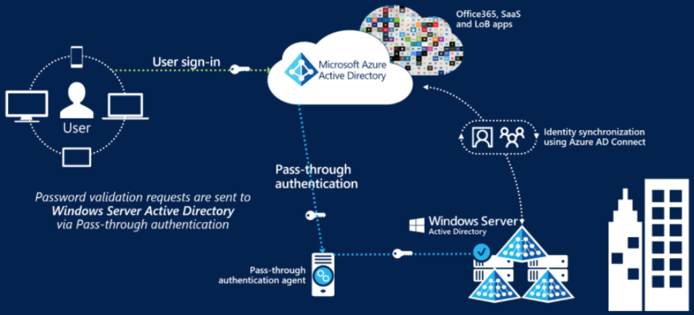

#### Deploy Federation with Azure AD

Federation is a collection of domains that have established trust. You can federate your on-premises environment with
Azure AD and use this federation for authentication and authorization. This sign-in method ensures that all user authentication
occurs on-premises. This method allows administrators to implement more rigorous levels of access control.

#### Authentication decision tree

#### Configure password writeback

Password writeback is a feature in Azure AD that allows users to reset password in the cloud and have that change reflected
in their on-prem directories. It can enforce on-prem password rules, is synchronous (no delay) and doesn't require any
outbound firewall rules (uses Azure Service Bus to communicate outbound over port 443).

### Deploy Azure AD identity protection

Identity Protection is a tool that allows organizations to automate the detection and remediation of identity-based risks.

- Creating access reviews to check on how each identity is being used and that the correct rights are assigned.
- Configure policies to identify risky user behaviors and odd sign-in patterns.
- Control and manage access to resources with conditional access policies.

#### Identity Protection policies

Identity Protection includes three default policies that admin can choose to enable.

- Multi-Factor authentication registration policy
  - Ensures new users sign up for MFA at registration
- Sign-in risk policy
  - Each sign-in event creates signales which Identity Protection will calculate a risk score from. These scores can be
  used by admins to decide wether to grant/block access or require MFA.
- User risk remediation policy

#### Configuring risk event detections

 Azure AD Identity Protection policies can automatically block a sign-in attempt or require additional action, such as
 requiring a password change or prompt for Azure AD Multi-Factor Authentication.

Some of the following actions may trigger Azure AD Identity Protection risk detection:

- Users with leaked credentials.
- Sign-ins from anonymous IP addresses.
- Impossible travel to atypical locations.
- Sign-ins from infected devices.
- Sign-ins from IP addresses with suspicious activity.

You can choose to turn the policy enforcement on or off, select users or groups for the policy to apply to, and decide
if you want to block access at sign-in or prompt for additional action.

- ***User risk policy*** - Identifies and responds to user accounts that may have compromised credentials. Can prompt
the user to create a new password.
- **Sign-in risk policy** - Identifies and responds to suspicious sign-in attempts. Can prompt the user to provide
additional forms of verification using Azure AD Multi-Factor Authentication.
- **MFA registration policy** - Makes sure users are registered for Azure AD Multi-Factor Authentication. If a sign-in
risk policy prompts for MFA, the user must already be registered for Azure AD Multi-Factor Authentication.

#### Implement user risk policy

Identity Protection can calculate what it believes is normal for a user's behavior and use that to base decisions for
their risk. User risk is a calculation of probability that an identity has been compromised.

With the information provided by the risky users report, administrators can find:

- Which users are at risk, have had risk remediated, or have had risk dismissed?
- Details about detections
- History of all risky sign-ins
- Risk history

Administrators can then choose to act on these events. Administrators can choose to:

- Reset the user password
- Confirm user compromise
- Dismiss user risk
- Block user from signing in
- Investigate further using Azure ATP (Azure Advanced Threat Detection, now known as Azure Defender)

#### Implement sign-in risk policy

Sign-in risk represents the probability that a given authentication request isn't authorized by the identity owner. It
supports the following conditions:

- Location
- Client apps
- Risky sign-ins

#### Deploy multi-factor authentication

The security of MFA two-step verification lies in its layered approach. Compromising multiple authentication factors presents
a significant challenge for attackers. Even if an attacker manages to learn the user's password, it is useless without
also having possession of the additional authentication method. Authentication methods include:

- Something you know (typically a password)
- Something you have (a trusted device that is not easily duplicated, like a phone)
- Something you are (biometrics)

MFA Options:

- Call to phone
- Text to phone
- Notification through mobile app
- Verification code from mobile ap

#### Azure AD conditional access

Conditional Access is at the heart of the new identity driven control plane. Using attributes that we know about users
(location, device, application) we can compute risk scores and those will determine if access is granted. They can be
though of as if-then statements and they are triggerd after the first-factor authentication has been complete (password).

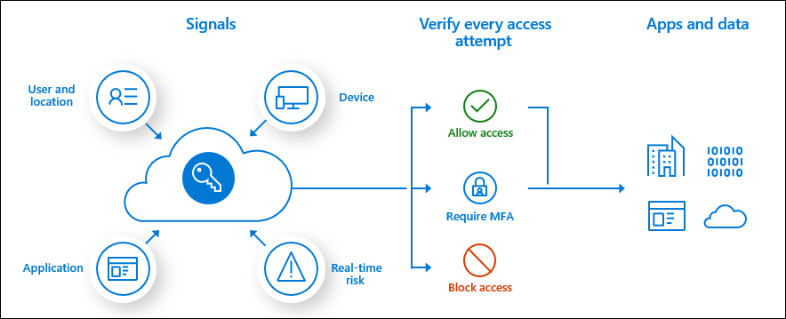

#### Configuring conditional access conditions

Conditional access comes with six conditions: user/group, cloud application, device state, location (IP range),
client application, and sign-in risk. You can use combinations of these conditions to get the exact conditional access
policy you need.

Conditional access conditions are configured in the portal through Azure Active Directory > Security > Conditional Access

### Configure Azure AD privileged identity management

#### Intro

- Configuring the scope of users and roles based on zero trust.
- Setting up a PIM workflow to enforce approval for role usage, and monitor the access.
- Implement just-in-time access.

#### Explore the zero trust model

Modern cybersecurity no longer just focuses on defense perimter, treating everything outside of it as hostile while
assuming that everything on the inside is safe. The current model assumes breach and uses the zero-trust model to
manage that new paradigm.

The Zero Trust model assumes breach and verifies each request as though it originates from an open network.

Notice the trust determination components:

- Identity provider. Establishes a user’s identity and related information.
- Device directory. Validates a device and the device integrity.
- Policy evaluation service. Determines whether the user and device conform to security policies.
- Access proxy. Determines which organizational resources can be accessed.

Implementing zero-trust requires the following:

- Signals: to make informed decisions
- Organizational policy: to guide decisions
- Enforcement ability

The guiding principles of zero trust are:

- Verify explicitly
- Use leasrt priviledged access
- Assume breach

##### Microsoft's zero trust architecture

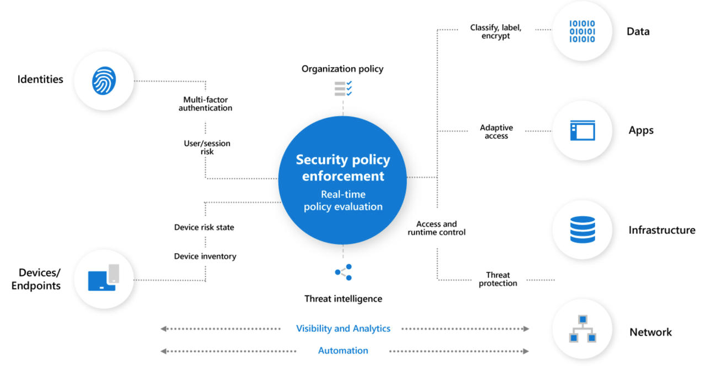

- Intune is used for device management and device security policy configuration
- Azure AD Conditional Access is used for device health/user validation
- Azure AD is used for user and device inventory

Ways to use PIM (Privileged Identity Management)

- View which users are assigned privileged roles to manage Azure resources, as well as which users are assigned
administrative roles in Azure AD.
- Enable on-demand, “just in time” administrative access to Microsoft Online Services like Microsoft 365 and Intune,
and to Azure resources of subscriptions, resource groups, and individual resources such as Virtual Machines.
- Review a history of administrator activation, including what changes administrators made to Azure resources.
- Get alerts about changes in administrator assignments.
- Require approval to activate Azure AD privileged admin roles.
- Review membership of administrative roles and require users to provide a justification for continued membership.

[Azure PIM Docs](https://learn.microsoft.com/en-us/azure/active-directory/privileged-identity-management/)

### Design an enterprise governance strategy

- Explain the shared responsibility model and how it impacts your security configuration
- Create Azure policies to protect your solutions
- Configure and deploy access to services using RBAC

As computing environments move from customer-controlled datacenters to the cloud, the responsibility of security also shifts.

Azure Resource Manager is the deployment and management service for Azure. It provides a consistent management layer that
allows you to create, update, and delete resources in your Azure subscription. You can use its access control, auditing,
and tagging features to help secure and organize your resources after deployment.

Azure provides four levels of scope: management groups, subscriptions, resource groups, and resources. 

You apply management settings at any of these levels of scope. The level you select determines how widely the setting is
applied. Lower levels inherit settings from higher levels.

#### Management Groups

Management groups are an Azure resource to create flexible and very maintainable hierarchies within the structure of
your environment. Management groups exist above the subscription level thus allowing subscriptions to be grouped together.
This grouping facilitates applying policies and RBAC permissions to those management groups.

The value of management groups:

- Group your subscriptions
- Mirror your oragnization structure
- Apply policies and RBAC controls to services

#### Configure Azure policies

Azure Policy is a service you use to create, assign, and manage policies. These policies enforce different rules and
effects over your resources so that those resources stay compliant with your corporate standards and service level
agreements. Azure Policy meets this need by evaluating your resources for noncompliance with assigned policies

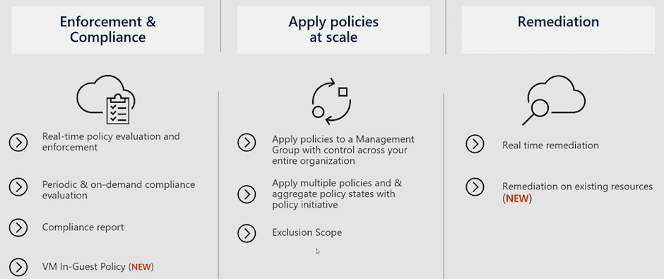

## [AZ-500: Implement platform protection](https://learn.microsoft.com/en-us/training/paths/implement-platform-protection/)

### Implement perimeter security

A security engineer uses perimeter security features to block network traffic away from your primary network resources

- Setup DDoS (denial-of-service) Protection.
- Configure and maintain firewalls.
- Use dedicated routes and network appliance to protect your network.

The key skills in the section are:

- Implement advanced network security
- Create and configure Azure Firewall
- Implement Azure Firewall Manager
- Configure a firewall on a storage account, Azure SQL, Key Vault, or App Service
- Implement DDoS protection

As previous models of perimeter defense become inadequate (DMZs, VNets ...) Network micro-segmentation is becoming the
new standard for protecting your assets. Granting access at access-time avoids the need to play a prediction game for
an entire deployment, network, or subnet – only the destination resource needs to provide the necessary access controls.

- **Azure Network Security Groups** can be used for basic layer 3 & 4 access controls between Azure Virtual Networks,
their subnets, and the Internet.
- **Application Security Groups** enable you to define fine-grained network security policies based on workloads,
centralized on applications, instead of explicit IP addresses.
- **Azure Web Application Firewall and the Azure Firewall** can be used for more advanced network access controls that
require application layer support.
- **Local Admin Password Solution (LAPS)** or a third-party Privileged Access Management can set strong local admin
passwords and just in time access to them.

#### Virtual network security

A VNet is a representation of your own network in the cloud. A VNet is a logical isolation of the Azure cloud network
dedicated to your subscription. You can connect VNets to your on-premises networks.

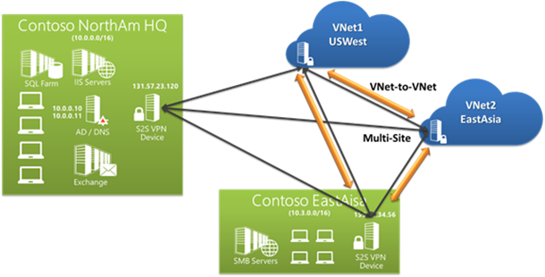

Azure supports dedicated WAN link connectivity to your on-premises network and an Azure Virtual Network with ExpressRoute.
The link between Azure and your site uses a dedicated connection that does not go over the public Internet. If your Azure
application is running in multiple datacenters, you can use Azure Traffic Manager to route requests from users intelligently
across instances of the application.

- **Virtual networks** are network overlays that you can use to configure and control the connectivity among Azure resources.
  - Scoped to a single Azure region
  - An Azure region is a set of datacenters deployed within a latency-defined perimeter and connected through a dedicated
  regional low-latency network.
  - You can implement multiple virtual networks within each Azure subscription and Azure region. Each virtual network is
  isolated from other virtual networks.
  - For each virtual network you can:
    - Specify a custom private IP address space using public and private addresses
    - Segment the virtual network into one or more subnets
    - Use Azure-provided name resolution, or specify your own DNS server
- **IP addresses**
  - **Private** - A private IP address is dynamically or statically allocated to a VM from the defined scope of IP addresses
  in the virtual network.
  - **Public** - Public IP addresses, which allow Azure resources to communicate with external clients, are assigned directly
  at the virtual network adapter of the VM or to the load balancer.
- **Subnets**
  - You can divide networks using subnets for logical and security-related isolation of resources.
- **Network adapters**
  - Virtual network adapters configure VMs IP address.
  - A VM can have more than one network adapter.

#### Enable Distributed Denial of Service (DDoS) Protection

Botnets: collections of internet-connected systems that an individual controls and uses without their owners’ knowledge.

DDoS: collection of attack types aimed at disrupting the availability of a target. These attacks involve a coordinated
effort that uses multiple internet-connected systems to launch many network requests against DNS, web services, email.

- Best practice 1: Ensure that security is a priority throughout the entire lifecycle of an application
Pillar

| Pillar       | Description                                                               |
| ------------ | ------------------------------------------------------------------------- |
| Scalability  | The ability of a system to handle increased load                          |
| Availability | The proportion of time that a system is functional and working            |
| Resiliency   | The ability of a system to recover from failures and continue to function |
| Management   | Operations processes that keep a system running in production             |
| Security     | Protecting applications and data from threats                             |

- Design your applications to scale horizontally to meet the demands of an amplified load
  - For Azure App Service, select an App Service plan that offers multiple instances.
  - For Azure Cloud Services, configure each of your roles to use multiple instances.
  - For Azure Virtual Machines, ensure that your VM architecture includes more than one VM and that each VM is included
  in an availability set.

- Layer security defenses in an application to reduce the chance of a successful attack.
  - reduce the surface area by using IP allowlists to close down the exposed IP address space and listening ports that
  aren’t needed on the load balancers
  - You can also use NSGs to reduce the attack surface. You can use service tags and application security groups as a 
  natural extension of an application’s structure to minimize complexity for creating security rules and configuring
  network security.

#### Configure a distributed denial of service protection implementation

- Infrastructure: using always-on traffic monitoring adn real-time mitigation of common network-level attacks.
- Network Protection: Protection policies are tuned through dedicated traffic monitoring and machine learning algorithms.
Policies are applied to public IP addresses associated to resources deployed in virtual networks, such as Azure Load
Balancer, Azure Application Gateway, and Azure Service Fabric instances, but this protection does not apply to App Service
Environments.

During mitigation, DDoS Protection redirects traffic sent to the protected resource and performs several checks, including:

- Helping ensure that packets conform to internet specifications and aren’t malformed.
- Interacting with the client to determine if the traffic might be a spoofed packet (for example, using SYN Auth or SYN
Cookie or dropping a packet for the source to retransmit it).
- Using rate-limit packets if it can’t perform any other enforcement method.

Types of denial-of-service attacks that Azure protection mitigates:

- Volumetric attacks: The attack's goal is to flood the network layer with a substantial amount of seemingly legitimate traffic.
- Protocol attacks: These attacks render a target inaccessible, by exploiting a weakness in the layer 3 and layer 4 protocol
stack. It includes, SYN flood attacks, reflection attacks, and other protocol attacks. DDoS Protection mitigates these
attacks, differentiating between malicious and legitimate traffic, by interacting with the client, and blocking malicious
traffic.
- Resource (application) layer attacks: These attacks target web application packets, to disrupt the transmission of data
between hosts. The attacks include HTTP protocol violations, SQL injection, cross-site scripting, and other layer 7 attacks.
Use a Web Application Firewall, such as the Azure Application Gateway web application firewall, as well as DDoS Protection
to provide defense against these attacks.

#### Azure Firewall features

Azure Firewall is a managed, cloud-based network security service that protects your Azure Virtual Network resources.

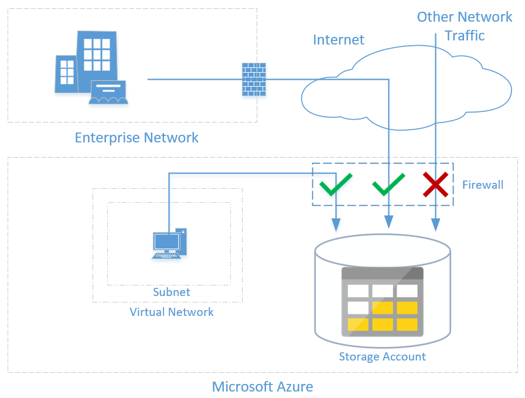

- **Built-in high availability** - Because high availability is built in, no additional load balancers are required and
there’s nothing you need to configure.
- **Unrestricted cloud scalability** - Azure Firewall can scale up as much as you need.
- **Application Fully Qualified Domain Name (FQDN) filtering rules** - You can limit outbound HTTP/S traffic to a specified
list of FQDNs, including wild cards. This feature does not require SSL termination.
- **Network traffic filtering rules** - You can centrally create allow or deny network filtering rules by source and
destination IP address, port, and protocol. Azure Firewall is fully stateful, so it can distinguish legitimate packets
for different types of connections.
- **Qualified domain tags** - Fully Qualified Domain Names (FQDN) tags make it easier for you to allow well known Azure
service network traffic through your firewall. For example, say you want to allow Windows Update network traffic through
your firewall. You create an application rule and include the Windows Update tag. Now network traffic from Windows Update
can flow through your firewall
- **Outbound Source Network Address Translation (OSNAT) support** - All outbound virtual network traffic IP addresses are
translated to the Azure Firewall public IP. You can identify and allow traffic originating from your virtual network
to remote internet destinations.
- **Inbound Destination Network Address Translation (DNAT) support** - Inbound network traffic to your firewall public IP
address is translated and filtered to the private IP addresses on your virtual networks.
- **Azure Monitor logging** - All events are integrated with Azure Monitor, allowing you to archive logs to a storage account,
stream events to your Event Hub, or send them to Azure Monitor logs.

Azure Firewall has three rule types: NAT rules, network rules, and application rules. The application order precedence
for the rules are that network rules are applied first, then application rules. Rules are terminating, which means if a
match is found in network rules, then application rules are not processed. If there’s no network rule match, and if the
packet protocol is HTTP/HTTPS, the packet is then evaluated by the application rules. If no match continues to be found,
then the packet is evaluated against the infrastructure rule collection. If there’s still no match, then the packet is
denied by default.

#### Firewall rules to secure Azure Storage

An application that accesses a storage account when network rules are in effect requires proper authorization on the request.
Authorization is supported with Azure AD credentials for blobs and queues, a valid account access key, or a SAS token.

You can configure storage accounts to allow access only from specific VNets. You enable a service endpoint for Azure
Storage within the VNet. This endpoint gives traffic an optimal route to the Azure Storage service. The identities of
the virtual network and the subnet are also transmitted with each request.

#### Deploy an Azure Firewall implementation

One way you can control outbound network access from an Azure subnet is with Azure Firewall. With Azure Firewall,
you can configure:

- Application rules that define fully qualified domain names (FQDNs) that can be accessed from a subnet.
- Network rules that define source address, protocol, destination port, and destination address.

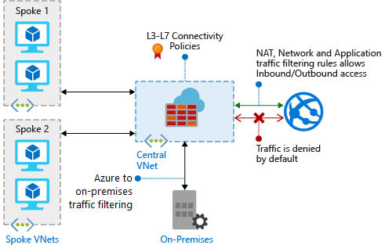

An FQDN tag represents a group of fully qualified domain names (FQDNs) associated with well known Microsoft services.
You can use an FQDN tag in application rules to allow the required outbound network traffic through your firewall.

For example, to manually allow Windows Update network traffic through your firewall, you need to create multiple application
rules per the Microsoft documentation. Using FQDN tags, you can create an application rule, include the Windows Updates
tag, and now network traffic to Microsoft Windows Update endpoints can flow through your firewall.

- Logs and metrics: You can access some of these logs through the portal. Logs can be sent to Azure Monitor logs,
Storage, and Event Hubs and analyzed in Azure Monitor logs or by different tools such as Excel and Power BI.
- Threat intelligence-based filtering: Threat intelligence-based filtering can be enabled for your firewall to alert
and deny traffic from/to known malicious IP addresses and domains. The IP addresses and domains are sourced from the
Microsoft Threat Intelligence feed. Intelligent Security Graph powers Microsoft threat intelligence and is used by multiple
services including Microsoft Defender for Cloud.
- Rule processing logic: You can configure NAT rules, network rules, and applications rules on Azure Firewall. Rule
collections are processed according to the rule type in priority order, lower numbers to higher numbers from 100 to 65,000.
- Service tags: A service tag represents a group of IP address prefixes to help minimize complexity for security rule
creation. You cannot create your own service tag, nor specify which IP addresses are included within a tag. Microsoft
manages the address prefixes encompassed by the service tag, and automatically updates the service tag as addresses change.

#### Configure VPN forced tunneling

A virtual private network (VPN) consists of remote peers sending private data securely to one another over an unsecured
network, such as the Internet. This is called Internet tunneling. Site-to-site (S2S) VPNs use tunnels to encapsulate data
packets within normal IP packets for forwarding over IP-based networks, using encryption to ensure privacy and authentication
to ensure integrity of data.

Forced tunneling lets you redirect, or force, all internet-bound traffic back to your on-premises location via a site-to-site
VPN tunnel for inspection and auditing. This is a critical security requirement for most enterprise IT policies. Without
forced tunneling, internet-bound traffic from your VMs in Azure always traverses from the Azure network infrastructure
directly to the internet—without the option to allow you to inspect or audit the traffic. Unauthorized internet access
potentially leads to information disclosure or other types of security breaches.

The workloads in the front-end subnet can continue to accept and respond to customer requests that come directly from
the internet. The mid-tier and back-end subnets use forced tunneling. Any outbound connections from these two subnets to
the internet are forced back to an on-premises site via one of the S2S VPN tunnels.

#### Create User Defined Routes and Network Virtual Appliances

**User Defined Routes:** A User Defined Routes (UDR) is a custom route in Azure that overrides Azure's default system
routes or adds routes to a subnet's route table. In Azure, you create a route table and then associate that route table
with zero or more virtual network subnets. Each subnet can have zero or one route table associated with it. If you create
a route table and associate it to a subnet, Azure either combines its routes with the default routes that Azure adds to 
a subnet or overrides those default routes.

**Network Virtual Appliances:** The NVA helps provide a secure network boundary by checking all inbound and outbound
network traffic and then passing only the traffic that meets the network security rules. However, the fact that all network
traffic passes through the NVA means that the NVA is a single point of failure in the network. If the NVA fails, no other
path will exist for network traffic, and all the back-end subnets will become unavailable.

To make an NVA highly available, deploy more than one NVA into an availability set.

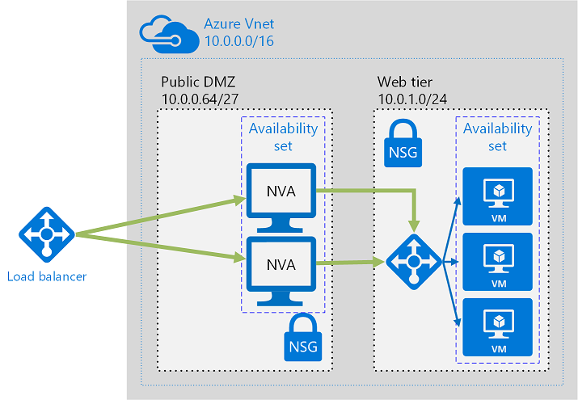

UDRs and NSGs help provide layer 3 and layer 4 (of the OSI model) security. NVAs help provide layer 7, application layer,
security.

#### Hub and spoke topology

The hub is a virtual network in Azure that acts as a central point of connectivity to your on-premises network. The spokes
are virtual networks that peer with the hub and can be used to isolate workloads. Traffic flows between the on-premises
datacenter and the hub through an ExpressRoute or VPN gateway connection.

The architecture consists of the following components:

- On-premises network
- VPN device: may be a hardware device or a software solution such as the Routing and Remote Access Service (RRAS)
- VPN virtual network gateway or ExpressRoute gateway: enables the virtual network to connect to the VPN device, or
ExpressRoute circuit, used for connectivity with your on-premises network.
- Hub virtual network: entral point of connectivity to your on-premises network, and a place to host services that can
be consumed by the different workloads hosted in the spoke virtual networks.
- Gateway subnet
- Spoke virtual networks
- Virtual network peering: Two virtual networks can be connected using a peering connection. Peering connections are
non-transitive, low latency connections between virtual networks.

### Configure network security

In Azure you can use tools such as Bastion, ExpressRoute & Front Door to lock down the network layer to attacks.

A security engineer will conduct the following task:

- Setup network security groups (NSGs) and Application Security Group (ASGs)
- Deploy Service Endpoints and Private Links
- Configure Front Door and ExpressRoute
- Configure Web App Firewalls (WAFs)
- Secure the connectivity of virtual networks (VPN authentication, ExpressRoute encryption)

#### Network security groups (NSGs)

Traffic to and from ressources can be controlled using NSGs which contains security rules. There are defaults that can't
be delete but can be overriden. Each rule is based on a source IP address, a source port, a destination IP address, and
a destination port.

- You can apply only one NSG to a VM, subnet, or network adapter.
- You can apply an NSG to multiple resources.
- You can have up to 200 rules in a single NSG
- NSGs can be applied to both a VM's network adapater as well as the subnet
- The order in which the rules are evaluated depends on the traffic direction.
  - Outbout traffic is evaluated from outer to innter (subnet first and then the VM's network interface)
  - Vice-versa for inbound traffic

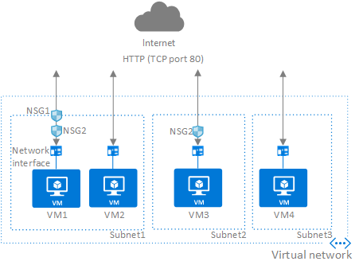

It is a best practice to only add NSGs to either the subnet or the network interface but not both as it can cause issues
if the rules conflict at different levels.

#### Service Endpoints

A vNet's service endpoint provides the identity of your vNet to Azure services. Once enbaled youn can secure the Azure
service ressources to your virtual network by adding a virtual network rule to the ressource.

Instead of using you vNet's public IP as the source IP you can instead use the private IP addresse when accessing a service
from a vNet. This removes the need for reserved public IP addresses used in IP firewalls.

A common usage case for service endpoints is a virtual machine accessing storage. The storage account restricts access
to the virtual machines private IP address.

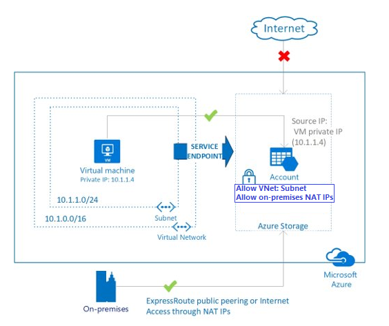

#### Private links

Azure private link work on an approval call model where teh service consumer will request a connection to the service
which in turn will decide wether to approve or deny the request.

The requests can be approved automatically using RBAC, or manually.

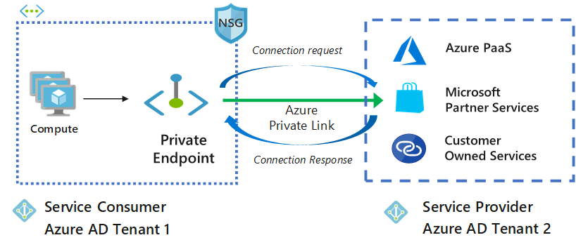

#### Azure application gateway

Application gateways are web traffic load balancers. Unlike regular load balancers that operate on the transport layer
(OSI layer 4), application gateways can make use of additional attributes from http requests (URI, headers ...)

They include the following features:

- Secure Sockets Layer (SSL/TLS) termination - Application gateway supports SSL/TLS termination at the gateway,
after which traffic typically flows unencrypted to the backend servers. This feature allows web servers to be unburdened
from costly encryption and decryption overhead.
- URL-based routing
- Ingress Controller for AKS - Application Gateway Ingress Controller (AGIC) allows you to use Application Gateway as
the ingress for an Azure Kubernetes Service (AKS) cluster.

#### Azure front door

Azure Front Door enables you to define, manage, and monitor the global routing for your web traffic by optimizing for
best performance and instant global failover for high availability.

Front Door works at Layer 7 or HTTP/HTTPS layer and uses split TCP-based anycast protocol. Front Door ensures that your
end users promptly connect to the nearest Front Door POP (Point of Presence).

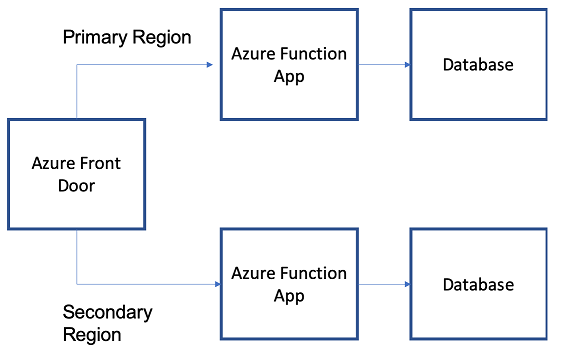

#### ExpressRoute

ExpressRoute is a direct, private connection from your WAN (not over the public Internet) to Microsoft Services,
including Azure. Site-to-Site VPN traffic travels encrypted over the public Internet. Being able to configure
Site-to-Site VPN and ExpressRoute connections for the same virtual network has several advantages

Encryption can be done in several ways:

- IPsec over ExpressRoute for Virtual WAN
  - Azure Virtual WAN uses an Internet Protocol Security (IPsec) Internet Key Exchange (IKE) VPN connection from your
  on-premises network to Azure over the private peering of an Azure ExpressRoute circuit.
- Point-to-point encryption by MACsec
  - MACsec is an IEEE standard. It encrypts data at the Media Access control (MAC) level or Network Layer 2.
- End-to-end encryption by IPsec and MACsec
  - IPsec is an IETF standard. It encrypts data at the Internet Protocol (IP) level or Network Layer 3.

### Enable Container Security

Containers are isolated silos that use the host's operating system's kernel to run. They are isolated from the surrounding
environment and do not persist data after a container unless they are using mounted persistent storage. They use the Docker
engine to start and manage the containers.

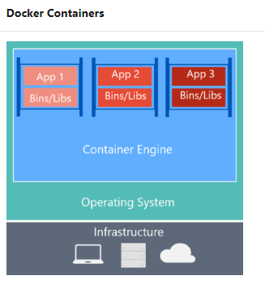

#### Configuring Azure Container Security

- Use a private registry
  - Containers are built from image layers that are "stacked" onto each other
  - The repositories for images can be public, such as Docker Hub. However for security images should be stored on private
  repositories (such as Docker Trusted Registry or Azure Container Registry)
  - These registries support RBAC (role based access controle) and in the case of Azure Container Registry, authentication
  flow using Azure Active Directory.
- Monitor and scan container images continuously
  - Microsoft Defender automatically scans all images in the registry, it intergrates Qualys scanner to detect image vulnerabilities
  and provide remidiation steps.
- Protect credentials
  - Tokens, passwords and secrets should be stored in appropriate encrypted databases, TLS encryption for secrets in transit
  and least-privilege role-based access control.
- Enforce least privileges at runtime
  - When an attacker compromises an application they gain as much access as the compromised application which is why its
  important to reduce exposure
- Log all container admin user access for auditing

#### Azure Container Instances (ACI)

ACI is a PaaS for scenarios that can oeprate in isolted containers (simple apps, task automation, build jobs) and do not
require. If full container orchestration is needed then Azure Kubernetes Service is required (AKS)

Features of ACI:

- Fast startup time
- Custom sizes: specify the CPU cores needed and memory
- Persistent storage: Using mounted Azure File Shares backed by Azure Storage
- Flexible billing: Per second/GB/CPU billing
- Co-scheduled groups: schedule multi-container groups that share a host machine, network, storage and lifecycle.
- Virtual network deployement: containers can securely communicate with other ressources on a network (including on-prem
  using VPN gateway or ExpressRoute)

#### Azure Container Registery

- Registry security
  - Login using Azure CLI or Docker CLI
  - Image transfer over HTPPS and TLS to secure client connections
  - Access using an Azure identity or Active Directory backed service principal
- Premium ACR sku features
  - content trust for image tag signing, firewalls and virtual networks to restrict access to registries
  - Azure Defender to scan images for vulnerabilities

Registries contain one or more repositories which are collections of artifact with the same name but differenct tags
such as:

- acr-helloworld:latest
- acr-helloworld:v1
- acr-helloworld:v2

Each artifact (image) is composed of one or more layer which are identified in the image's manifest. Each layer is set of
commands (called stanzas) in the image's Dockerfile

Container monitoring using log analytics provides the following:

- Detailed reports on the command used with the containers
- Centralized view of all the logs across containers
- Identify noisy and ressource intensive containers
- Centralised view of CPU, memory, storage and network usage

#### Enabling Azure Container Registry Authentication

There are three ways to authenitcate with Azure Container Registries

- Individual login with Azure AD
  - using the azure cli you can login directly and a token will be created for your session which will be cached and used
  by the Docker Engine that is running in your environment (by setting it in the docker.config file). This option is uselful
  for development purposes while pushing/pulling images.
- Service Principals
  - By assigning a service principal to an application/service will alow for headless authentication and role based access
  to the registry. This will allow you apps to ustilize/access the registry when deploying.
  - The roles available are AcrPull: pull, AcrPush: pull and push, Owner: pull, push, and assign roles to other users
- Admin accounts
  - Each registry has an admin account that is disabled by default. If enabled they have two passowrds that can be used
  similarly to Azure AD logins from the CLI. Either of the passwords can be used and both can be regenerated.

#### Azure Kubernetes Service (AKS)

App developement is moving towards containarisation which exposed the needs to orchesrate multiple containers in a fault
tolerant way. Kubernetes is the industry standard and AKS is Azure's version of it. It manages the networking and storage
component of multi-cotainer app architectures.

AKS is split into two components:

- Control plane nodes that provide the core kubernetes functionalities
- The application nodes that you run your workloads on

Features of AKS include:

- Fully managed
- Public IP and FQDN (Private IP option)
- Accessed with RBAC or Azure AD
- Deployment of containers
- Dynamic scale containers
- Automation of rolling updates and rollbacks of containers
- Management of storage, network traffic, and sensitive information

#### Azure Kubernetes Service architecture

AKS architecture is a set of reccomendation to deploy secure container based apps

Cluster master:

An Azure ressource that is created at the same time of the creation of an AKS cluster. It includes the following core
kubernetes components:

- kube-apiserver: It exposes the undeleying API and provides the interaction with the management tools such as **kubectl**
and the Kubernetes dashboard
- etcd: a highly available key-value store that is used as a cache for configuration and state of the cluster
- kube-scheduler: determines which nodes can start which applications and when
- kube-controller-manager: manages a number of smaller controllers that handle pod replication and node operations.

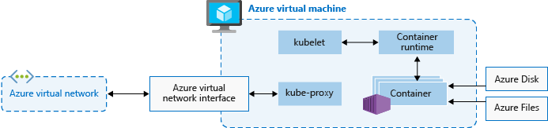

The VM of the node will decide the CPU/Storage/Memory availble and you need to plan out accordingly. The nodes can be scaled
out horizontally to meet demand. AKS VM can either use Ubuntu linux or Windows Server 2019

##### AKS Terminology

| Term       | Description                                                              |
| ---------- | ------------------------------------------------------------------------ |
| Pools      | Group of nodes with identical configuration                              |
| Node       | Individual VM running containerized applications                         |
| Pods       | Single instance of an application. A pod can contain multiple containers |
| Deployment | One or more identical pods managed by Kubernetes                         |
| Manifest   | YAML file describing a deployment                                        |

##### Master security

The Kubernetes API server uses a public IP address and a fully qualified domain name (FQDN). You can control access to
the API server using Kubernetes role-based access controls and Azure Active Directory.

##### Node security

Azure nodes that are run on Ubuntu get secturity patches applied on a nightly basis however Microsoft does not and requires
manual upgrades.

Pod Security Policies or more fine-grained role-based access controls (RBAC) for nodes make exploits more difficult.
However, for true security when running hostile multi-tenant workloads, a hypervisor is the only level of security that
you should trust. The security domain for Kubernetes becomes the entire cluster, not an individual node.

#### Configure Azure Kubernetes Service networking

Kubernetes provides an abstraction layer to virtual networking. The nodes are connected to a virtual network and provide
inbound/outbound connectivity for pods. This is accomplished using the kube-proxy component that runs on each node.

Services logically group pods to allow access via direct IP or DNS name with a specific port. Load balancer can be used
distribute traffic and Ingress Controllers can be used to configure more complex routing.

Security and filtering of traffice is achieved using Kubernetes network policies.

##### Services

- ClusterIP
  - Internal IP address to be used to internal-only applications.
- NodePort
  - Create a port mapping for the Node to be accessed through IP/Port combination
- Load Balancer
  - Configures an external IP address, and connects the requested pods to the load balancer backend pool
- ExternalName
  - Creates a specific DNS entry for easier application access.

#### Deploy Azure Kubernetes Service storage

Pods are ephemeral ressources and application may need to persist data accross pods being scheduled of instanciated on new
nodes.

Volumes are used to attach persistent storage to pods:

- Azure Disks: Disks can use Azure Premium storage, backed by high-performance SSDs, or Azure Standard storage, backed
by regular HDDs. However they are only accessible to only one pod at a time. In case data needs to be shared by multiple
nodes, use Azure Files.
- Azure Files: SMB 3.0 shares backed by an Azure Storage account to pods

Storage classes are used to define the storage type as well as the reclaim policy for a pod (they define how the underlying
storage ressources are managed upon pod delete/move)

There are two type of StorageClasses:

- default - Uses Azure Standard storage to create a Managed Disk. The reclaim policy indicates that the underlying Azure
Disk is deleted when the persistent volume that used it is deleted.
- managed-premium - Uses Azure Premium storage to create Managed Disk. The reclaim policy again indicates that the underlying
Azure Disk is deleted when the persistent volume that used it is deleted.

#### Secure authentication to Azure Kubernetes Service with Active Directory

Service accounts: One of the primary user types in Kubernetes is a service account. A service account exists in, and is
managed by, the Kubernetes API. The credentials for service accounts are stored as Kubernetes secrets, which allows them
to be used by authorized pods to communicate with the API Server. Most API requests provide an authentication token for
a service account or a normal user account.

Azure Active Directory integration: With Azure AD, you can integrate on-premises identities into AKS clusters to provide
a single source for account management and security. You can grant users or groups access to Kubernetes resources within
a namespace or across the cluster. To obtain a kubectl configuration context, a user can run the az aks get-credentials
command. When a user then interacts with the AKS cluster with kubectl, they are prompted to sign in with their Azure AD
credentials. Azure AD authentication in AKS clusters uses OpenID Connect.

#### Role-based access controls

Roles and ClusterRoles: Roles are used to grant permissions within a namespace. If you need to grant permissions across
the entire cluster, or to cluster resources outside a given namespace, you can instead use ClusterRoles.

RoleBindings and ClusterRoleBindings: Once roles are defined to grant permissions to resources, you assign those Kubernetes
RBAC permissions with a RoleBinding. If your AKS cluster integrates with Azure Active Directory, bindings are how those
Azure AD users are granted permissions to perform actions within the cluster.

Kubernetes Secrets: A Kubernetes Secret is used to inject sensitive data into pods, such as access credentials or keys.
You first create a Secret using the Kubernetes API. When you define your pod or deployment, a specific Secret can be requested.
Secrets are only provided to nodes that have a scheduled pod that requires it, and the Secret is stored in tmpfs, not
written to disk. The use of Secrets reduces the sensitive information that is defined in the pod or service YAML manifest.

[Lesson Summary](https://learn.microsoft.com/en-ca/training/modules/enable-containers-security/14-summary)

## [AZ-500: Secure your data and applications](https://learn.microsoft.com/en-us/training/paths/secure-your-data-applications/)

### [Deploy and secure Azure Key Vault](https://learn.microsoft.com/en-ca/training/modules/azure-key-vault/)

A security engineer needs to be able to protect an organization keys/secrets/certificates. Theyre expected to:

- Deploy and manage key vaults
- Design a strategy for backups/key rotations/other protections

Azure Key Vault allows security admin to create/manage/protect cryptographic keys and certificates that are used to
encrypt and access data in Azure ressources.

<!-- markdownlint-disable MD013 -->
| Best Practice                                                             | Solution                                                                                                                                                                                                                                                                         |
| ------------------------------------------------------------------------- | -------------------------------------------------------------------------------------------------------------------------------------------------------------------------------------------------------------------------------------------------------------------------------- |
| Grant access at specific scopes                                           | Use RBAC's predefined roles. The scope can be subscription, a resource group, or just a specific key vault.                                                                                                                                                                      |
| Control what users have access to                                         | Access is controlled via two independant planes, management and data. If an applcation needs access to the keys in a vault you will provide access to the data plane, if a user needs access to read teh properties/tags of a vault you'd provide access to the management plane |
| Ensure that you can recover a deletion of key vaults or key vault objects | Enable the soft delete and purge protection features of Key Vault to protect against inavertant or malicious actions                                                                                                                                                             |

<!-- markdownlint-enable MD013 -->

**If a user has contributor permissions (RBAC) to a key vault management plane, they can grant themselves access to the
data plane by setting a key vault access policy. It's recommended that tightls control are set on who has contributor
access to key vaults**

#### Configuring Key Vault Access

Access to key vaults is done via two interfaces, the management plane and the data plane

- Management plane: you create/delete vaults, access key vault properties, create/update access policies
- Data plane: you create/update/deletes keys and certificates

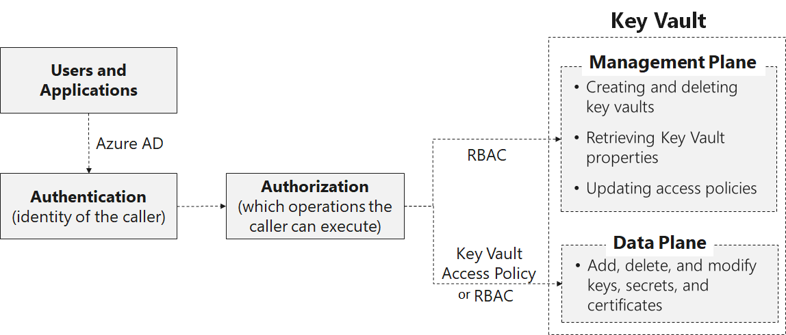

Active Directory authentication

- User plus application access: The application access key vault on behalf of the user (such as Azure PowerShell and Azure
  Portal). They can either access through any application or a spefic applicaiton (aka compound identity)
- Application-only access. The application runs as a daemon service or background job. The application identity is granted
access to the key vault.

For both types the application authenticates with Azure AD and obtains a token from the plane to get access.

#### Deploying and managing Key Vault certificates

When a ceritificate is created an addressable key and secret are also created. The key allows key operations and the secret
allows retrieval of the certificate value as a secret. A Key Vault certificate also contains public x509 certificate metadata.

When a Key Vault certificate is created, it can be retrieved from the addressable secret with the private key in either
PFX or PEM format. However, the policy used to create the certificate must indicate that the key is exportable.

A certificate policy contains information on how to create and manage the Key Vault certificate lifecycle. When a
certificate with private key is imported into the Key Vault, a default policy is created by reading the x509 certificate.

A certificate policy contains the following information:

- X509 certificate properties. Contains subject name, subject alternate names, and other properties used to create an
  x509 certificate request.

- Key Properties. Contains key type, key length, exportable, and reuse key fields. These fields instruct key vault on
  how to generate a key.

- Secret properties. Contains secret properties such as content type of addressable secret to generate the secret value,
  for retrieving certificate as a secret.

- Lifetime Actions. Contains lifetime actions for the Key Vault certificate. Each lifetime action contains:

- Trigger, which specifies via days before expiry or lifetime span percentage.

- Action, which specifies the action type: emailContacts, or autoRenew.

- Issuer: Contains the parameters about the certificate issuer to use to issue x509 certificates.

- Policy attributes: Contains attributes associated with the policy.

#### Creating Key Vault keys

Keys are represented as JSON Web Key (JWK) objects. They can be either **soft keys** or **hard keys**

- Soft Keys: processed in software by Key Vault, but is encrypted at rest using a system key that is in an Hardware Security
  Module (HSM). Clients may import an existing RSA or EC (Elliptic Curve) key, or request that Key Vault generate one.
- Hard Keys: A key processed in an HSM (Hardware Security Module). These keys are protected in one of the Key Vault HSM
  Security Worlds (there's one Security World per geography to maintain isolation).

Key operations

- Create: The value of the key is generated by Key Vault and stored, and isn't released to the client.
- Import: Import an existing key to Key Vault. Asymmetric keys can be imported to Key Vault using different packaging 
  methods within a JWK construct.
- Update: Users with sufficient permissions can modify the metadata (key attributes) of a key.
- Delete: Users with sufficient permissions can delete a key from Key Vault

Cryptographic operations

- Sign and Verify: Strictly, this operation is "sign hash" or "verify hash", as Key Vault doesn't support hashing of
  content as part of signature creation. Applications should hash the data to be signed locally, then request that Key
  Vault sign the hash.
- Key Encryption / Wrapping: A key stored in Key Vault may be used to protect another key, typically a symmetric content
  encryption key (CEK). When the key in Key Vault is asymmetric, key encryption is used. When the key in Key Vault is
  symmetric, key wrapping is used.
- Encrypt and Decrypt: A key stored in Key Vault may be used to encrypt or decrypt a single block of data. The size of
  the block is determined by the key type and selected encryption algorithm.

Apps hosted in App Service and Azure Functions can now simply define a reference to a secret managed in Key Vault as part
of their application settings. The app’s system-assigned identity is used to securely fetch the secret and make it available
to the app as an environment variable.

#### Managing customer managed keys

Secrets can be rotated in several ways:

- As part of a manual process
- Programmatically by using REST API calls
- Through an Azure Automation script

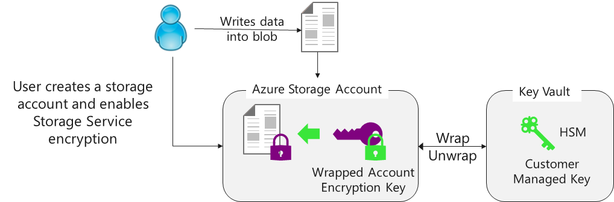

Customers can rotate their key in Azure Key Vault as per their compliance policies. When they rotate their key, Azure
Storage detects the new key version and re-encrypts the Account Encryption Key for that storage account. Key rotation
does not result in re-encryption of all data and there is no other action required from user.

#### Enabling Key Vault secrets

Key Vault provides secure storage of secrets, such as passwords and database connection strings. From a developer's perspective,
Key Vault APIs accept and return secret values as strings. Internally, Key Vault stores and manages secrets as sequences
of octets (8-bit bytes), with a maximum size of 25k bytes each.

The values for Key Vault Secrets are:

- Name-value pair - Name must be unique in the Vault
- Value can be any UTF-8 string - max of 25 KB in size
- Manual or certificate creation
- Activation date
- Expiration date

Azure Key Vault service encrypts your secrets when you add them, and decrypts them automatically when you read them.
The encryption key is unique to each key vault.

#### Configure key rotation

- Thirty days before the expiration date of a secret, Key Vault publishes the "near expiry" event to Event Grid.
- Event Grid checks the event subscriptions and uses HTTP POST to call the function app endpoint subscribed to the event.
- The function app receives the secret information, generates a new random password, and creates a new version for the
  secret with the new password in Key Vault.
- The function app updates SQL Server with the new password.

#### Managing Key Vault safety and recovery features

There are two primary ways of recovering keys:

Azure Key Vault Soft-delete
  

Key Vault Backup, intended to provide you with an offline copy of all your secrets in the unlikely event that you lose
access to your key vault.

[Module Summary](https://learn.microsoft.com/en-ca/training/modules/azure-key-vault/14-summary)

### [Implement storage security](https://learn.microsoft.com/en-us/training/modules/storage-security/)

Among the responsabilities of a security engineer is the protection of their organization's data:

- Lock access to specfic users and apps
- Encrypt data at rest and during transit

#### Data sovereignty

Data sovereignty is defined as the laws that regulate the privacy of data and who has control over it. It encompasses
cross border treaties and prevents data from being subpeonaed by countries and region government (e.g: The EU)

Azure oeprates in many regions of teh world. The hierarchy is shown below:

A geography contains at least one region. Each region contains at least one datacenter. Regions are organised in pairs.
The benefits of this arrangement is the added security layer for disaster recovery and business continuity. Physical isolation,
replication, data residency requirements are among the other benefits.

#### Modalities to Access Ressources in Azure Storage

Data hosted on Azure can be accessed using any of the below authentication methods:

- Azure Active Directory: Azure storage integrates with Azure AD for identit based authorizxation to Blob and Queu services
- Azure Active Directory Domain Services: For Azure Files, identity authorization over Server Message Block (a network file
  sharing protocol) is used. Role based access control is possible.
- Shared key: An access key can be used to create an encrypted signature to pass in a request's authorization header
- Shared access signatures (SAS): These are URIs (univeral ressource identifiers) that provide shared access to clients
  for a specific amount of time and specific permissions. The query params of teh SAS token have all the info needed to
  access to storage ressources
  !!! HOW DO SAS TOKENS WORK?
- Anonymous access to containers and blobs: Read-only public access to blob storage is possible in cases where you don't
  care who access your information (it's public, such as a sales presentation pdf file)

#### Shared access signatures

If third party apps need top access your data it's better not to give them access to your storage account keys. Instead
you can share SHARED ACCESS TOKENS (SAS) which are strings that contain security tokens that can be attached to URIs.

Such SAS can provide contraints (time/permissions etc) over the ressources for more fine grained controle. An example would
be of one SAS that you issue to a client can be used to upload a picture to storage, while another can be used by another
client to read/view that picture.

If an SAS is suspected of being compromised it can be revoked.

#### Azure AD Storage Authentication

Azure AD can authenticate users and issue them OAuth 2.0 tokens which can then be used to authorise requests against storage
accounts. The security principal (user, group or application) that makes the request to access needs to have at least one
Azure role which will determine their access permissions

!!! WHAT ARE THE INTERNAL MECHANICS OF OAUTH

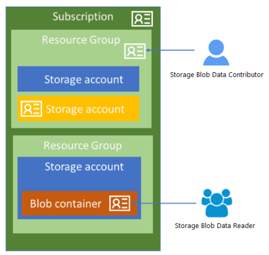

#### Storage Encryption

- Data stored in Azure Storage is automatically encrypted using Stroge Service Encryption (SSE) using 256-bit AES encryption.
- Azure AD and RBAC are supported for both ressrouce management operations and data operations
  - RBAC roles scoped to security pricipalte to authorize ressource management oeprations such as key management
  - RBAC roles scoped to subscription/ressource groups/storage accounts/containers/queues for blob/queu data oeprations
- Data secured in transit using client-side encryption, HTTPS or SMB 3.0
- Data disks encrypted using Azure Disk Encryption

Azure clients can either use Microsoft-managed keys or use their own keys. They have teh option between :

- customer-managed keys for all operations in the storage account
- customer-provided keys for Blob storage operations that can provide granular control on how blob data is encrypted/decrypted

#### Data retention policies

Immutable storage for Azures Blob storage allow critical data object to be stored in a WORM state (write once, read many).

Data retention policies can either be time-based of legal holds:

- Time based: specific interval in which the data must be kept. After these intervals the data can be deleted but not overwritten
- Legal hold have indefinit time horizons in which the data can be read but not modified. Legal holds associate with tags
  (case name, event names). Legal holds can be tied to investigations of general protection policies

#### AZURE Files Authentication

Azure Files supports identity-based authentication over Server Message Block (SMB) through on-premises Active Directory
Domain Services (AD DS) and Azure Active Directory Domain Services (Azure AD DS).

Azure leverages kerberos protocol to authenticate requests and provides token which can be used to access the Azure File
Shares

Azure Files preserves the current permissions ACLs (access control lists) when copying files. Azure File Sync or other
tools can be used to copy the file and preserve teh ACLs

### [Configure and manage SQL database security](https://learn.microsoft.com/en-us/training/modules/sql-database-security/)

#### SQL Database Authentication

#### Configuring Database Firewalls

#### Database Auditing

#### Data discovery and classification

#### Vulnerability Assessements

#### Dynamic Data Masking

#### Transparent Data Encryption

#### Always Encrypted Data

Always encrypted data is a feature where the owners of the data and the applications that they use encrypt the data on
the application side, using keys that are never exposed to the database. Thus all the data stored is isolated and protected
even from the users who manage the data.

The encrypted data is passed to the database engine. In order for it to be queried there are the Always Encrypted driver
used by the client rewrites queries to preserve the application semantics so that the database driver can still query the
data even though it's encrypted.

There are two types of encryptions under this paradigm: **Deternministic** and **Randomized**. Deterministic always generates
he same cyphertext when given the same plaintext which allows for allows point lookups, equality joins, grouping and
indexing on encrypted columns. This option is less secure that randomized encryption because it still allows for the possibility
, although improbable, that a bad actor can guess the logic and get around the encryption. However, randomized encryption
makes it harder to query the data as point lookups, equality joins, grouping and indexing is not possible.

To setup always encrypted paragdigm you need to generate **Always Encrypted keys**. This can be done via SQL Server Management
Studio (SSMS) or PowerShell.

Always Encrypted uses two types of keys: column encryption keys and column master keys. A column encryption key is used
to encrypt data in an encrypted column. A column master key is a key-protecting key that encrypts one or more column
encryption keys.

The database stores the encrypted keys stores encrypted values of column encryption keys and the information about the
location of column master keys, which are stored in external trusted key stores, such as Azure Key Vault, Windows
Certificate Store on a client machine, or a hardware security module.

To query the encrypted data a client application must use an Always Encrypted enabled client driver.For each parameter
that needs to be encrypted, the driver obtains the information about the encryption algorithm and the encrypted value of
the column encryption key for the column, the parameter targets, as well as the location of its corresponding column
master key. Next, the driver contacts the key store, containing the column master key, in order to decrypt the encrypted
column encryption key value and then, it uses the plaintext column encryption key to encrypt the parameter.

The driver substitutes the plaintext values of the parameters targeting encrypted columns with their encrypted values,
and it sends the query to the server for processing.

### [Configure Application Security Features](https://learn.microsoft.com/en-us/training/modules/application-security/)

#### Microsoft Identity Platform

Microsoft Identity Platform is the next evolution of Microsoft Active Directoy. It uses OAuth and OpenID Connect for authorization
and authentiation, respectivly. It allows devellopers to offer single sign on **(SSO)** for user and tokens for accessing
APIs such as **Microsoft Graph** and APIs that they've built.

The Identity Platform (v2.0) offers more features than the first generation Active Directory (v1.0) endpoint.

- Microsoft Authentication Library **(MSAL)** is an easy to use open source project that was developed using the
  Secure Development Lifecycle **(SDL)**
- Incremental consent can be configured into application in order to provide access to more privileged scopes only when
  warranted.
- Azure Active Directory B2C is also supported in MSAL which allows users to sign-in using their preffered social/enterprise/personal
  accounts.
  - Azure provisionned accounts (schools / business accounts)
  - Personal accounts ( Hotmail / Outlook )
  - Social identities (Google/LinkedIn/Facebook ...) through Active Directory B2C (business to consumer)

MSAL can be used for many scenarios, includin:

- Web apps signing in users
  - Web apps calling a web API on behalf of signed in users
- Web APIs calling downstream APIs on behalf of signed-in users
- Desktop/Mobile appllications calling web APIs on behalf of signed-in users
- Deamon/Desktop applications calling APIs on behalf of themselves

MSAL is offered in a number of frameworks such as Android, Angular, iOS, MacOS, Javascrips, Java, Go & Python.

Active Directory Authenication Library, aka ADAL (v1.0) supports only work accounts while MSAL (v2.0) supports personal
and social accounts as well. Additionally MSAL has a feature called **Continous Access Evaluation** that allows tokens
to be revoked on critical events and policy evaluations as opposed to only token lifetime expiry. Such events can be:

- User Account is deleted or disabled
- Password for a user is changed or reset
- Multifactor Authentication is enabled for the user
- Administrator explicitly revokes all refresh tokens for a user
- High user risk detected by Azure AD Identity Protection

[Continuous Access Evaluation Documetations](https://learn.microsoft.com/en-us/azure/active-directory/develop/app-resilience-continuous-access-evaluation?tabs=dotnet)

[Identity Platform Documentation](https://learn.microsoft.com/en-us/azure/active-directory/develop/)

[ID Token Documentation](https://learn.microsoft.com/en-us/azure/active-directory/develop/id-tokens)

[Guide to migrating from ADAL to MSAL](https://learn.microsoft.com/en-us/azure/active-directory/develop/msal-migration)

#### Registering apps with identity platforms

In order for apps to receive tokens from Azure Identity Platform they need to be registered. This integrates the app with
the Identity service and establishes basic information about it that is needed to obtain tokens:

- Application ID
- Redirect URL/URI: endpoint that the app receives responses from Azure Identity Platform (URIs for mobile apps)
- Application secrects: Either a password or a public/private key pair that the app will use to authenticate with Azure.

Devellopers will use authentication libraries abstract many protocol details, like validation, cookie handling, token
caching, and maintaining secure connections.

When apps are registered (either single or multi tenant) they will have a global application object created. This object
will serve as a blueprint for the app which will be used to create an application service principal in each of the tenants
in which the application runs.

Application object is the global representation of your application for use across all tenants, and the service principal
is the local representation for use in a specific tenant

[App Registration & Service Principal Documenation](https://learn.microsoft.com/en-us/azure/active-directory/develop/app-objects-and-service-principals)

#### Microsoft Graph

Microsoft Graph Security API makes it easy to connect with security solutions from Microsoft and partners. It acts as a broker
that gets user consent from a user and relays that to all security providers in the ecosystem. This way an application can
get user consent once and receive scopes from multiple services.

1. The application user signs in to the provider application to view the consent form from the provider. This consent
   form experience or UI is owned by the provider and applies to non-Microsoft providers only to get explicit consent
   from their customers to send requests to Microsoft Graph Security API.
2. The client consent is stored on the provider side.
3. The provider consent service calls the Microsoft Graph Security API to inform consent approval for the respective customer.
4. The application sends a request to the Microsoft Graph Security API.
5. The Microsoft Graph Security API checks for the consent information for this customer mapped to various providers.
6. The Microsoft Graph Security API calls all those providers the customer has given explicit consent to via the provider
   consent experience.
7. The response is returned from all the consented providers for that client.
8. The result set response is returned to the application.
9. If the customer has not consented to any provider, no results from those providers are included in the response.

Microsoft Graph helps unify and standardise alert tracking and response by integrating data from multiple sources and corellating
alerts from alerts across security solutions.

#### Enabling Managed Identities

Managed Identities is used to authenticate to any service that supports Azure AD authentication, including Key Vault,
without any credentials in your code.

Terminology:

- Client ID - a unique identifier generated by Azure AD that is tied to an application and service principal during its
  initial provisioning.
- Principal ID - the object ID of the service principal object for your managed identity that is used to grant role-based
  access to an Azure resource.
- Azure Instance Metadata Service (IMDS) - a REST endpoint accessible to all IaaS VMs created via the Azure Resource Manager.
  The endpoint is available at a well-known non-routable IP address (169.254.169.254) that can be accessed only from
  within the VM.

There are two types of identities for Azure ressources:

- System-assigned managed identity are enabled directly on an Azure service instance. The lifecyle of the indetity is the
  same as the underlying service and get purged once the service is deleted.
- User-assigned managed identity is created as a standalone Azure resource. After the identity is created, the identity
  can be assigned to one or more Azure service instances. It's lifecycle is separate from the underlying service.

Credential are rotated every 46 days but its up to the service provider to call for new credentials so it can be longer.

1. Azure Resource Manager receives a request to enable the system-assigned managed identity on a VM.
2. Azure Resource Manager creates a service principal in Azure AD for the identity of the VM. The service principal is
   created in the Azure AD tenant that's trusted by the subscription.
3. Azure Resource Manager configures the identity on the VM by updating the Azure Instance Metadata Service identity
   endpoint with the service principal client ID and certificate.
4. After the VM has an identity, use the service principal information to grant the VM access to Azure resources. To call
   Azure Resource Manager, use role-based access control (RBAC) in Azure AD to assign the appropriate role to the VM
   service principal. To call Key Vault, grant your code access to the specific secret or key in Key Vault.
5. Your code that's running on the VM can request a token from the Azure Instance Metadata service endpoint,
   accessible only from within the VM: http://169.254.169.254/metadata/identity/oauth2/token
6. The resource parameter specifies the service to which the token is sent. To authenticate to Azure Resource Manager,
   use resource=https://management.azure.com/.
7. API version parameter specifies the IMDS version, use api-version=2018-02-01 or greater.
8. A call is made to Azure AD to request an access token (as specified in step 5) by using the client ID and certificate
   configured in step 3. Azure AD returns a JSON Web Token (JWT) access token.
9. Your code sends the access token on a call to a service that supports Azure AD authentication

#### Azure app service

Azure App Service is an HTTP-based service for hosting web applications, REST APIs, and mobile backends. You can develop
in your favorite language and applications run and scale with ease on both Windows or Linux.

It adds security, load balancing, autoscaling, and automated management as well as DevOps capabilities, such as continuous
deployment from Azure DevOps, GitHub, Docker Hub, and other sources, package management, staging environments, custom domain,
and TLS/SSL certificates.

Among the various advantages of App Serice:

- Multiple languages and frameworks
- Managed production environment
- Containerization and Docker
- DevOps optimization
- Global scale with high availability
- Connections to SaaS platforms and on-premises data - Choose from more than 50 connectors
- Security and compliance - ISO, SOC, and PCI compliant. Authenticate users with Azure Active Directory, Google, Facebook.
  Create IP address restrictions and manage service identities. Prevent subdomain takeovers.
- Application templates
- Visual Studio Code integration - Dedicated tools for creating, deploying, and debugging.
- API and mobile features - enabling authentication, offline data sync, push notifications ...
- Serverless code - Run a code snippet or script on-demand without having to explicitly provision or manage infrastructure

App Service Environment is an Azure App Service feature that provides a fully isolated and dedicated environment for
running App Service apps securely at high scale. An App Service plan is essentially a provisioning profile for an application
host. A single App Service Environment v3 can have up to 200 total App Service plan instances across all the App
Service plans combined

An app service always runs in an App Service plan wich is defined as a set of compute resources for a web app to run.

Each App Service plan defines:

- Operating System (Windows, Linux)
- Region (West US, East US, etc.)
- Number of VM instances
- Size of VM instances (Small, Medium, Large)
- Pricing tier (Free, Shared, Basic, Standard, Premium, PremiumV2, PremiumV3, Isolated, IsolatedV2)

When you install an App Service Environment, you pick the Azure virtual network that you want it to be deployed in.
All of the inbound and outbound application traffic is inside the virtual network you specify. You deploy into a single
subnet in your virtual network, and nothing else can be deployed into that subnet.

Azure App Service Environment can be deployed across availability zones (AZ) to help you achieve resiliency and reliability

You can add security certificates to you apps and secure a cutom DNS name to use with you application code. You can proivision
them through:

- Creating a free App Service managed certificate
- Purchasing an App Service certificate: A private certificate that's managed by Azure.
- Importing a certificate from Key Vault
- Uploading a private certificate
- Upload a public certificate: Public certificates are not used to secure custom domains, but you can load them into
  your code if you need them to access remote resources.

## [AZ-500: Manage security operation](https://learn.microsoft.com/en-us/training/paths/manage-security-operation/)

### [Configure and manage Azure Monitor](https://learn.microsoft.com/en-ca/training/modules/azure-monitor/)

Azure monitor watches how your ressources and triggers alerts if needed. A security engineer will be tasked with configuring
Azure Monitor to read metrics and logs, setup and respond to alert as well as well as reviewing diagnostics settings.

Azure Monitor collects metrics (such as VM CPU usage) as well as application logs. It can use pre-configured queries to
retrieve and analyse the data. They can then be used to create visualizations or configure alerting rules.

Azure Monitor streams data to an event hub that routes this data into a **Security Information & Event Monitoring** Solution
(SIEM).

Data collected can be:

- Application monitoring data (by instrumenting your code with an SDK such as the Application Insights SDK) or
  or running agents that listen to your application logs (Windows Azure Diagnostic Agent or Linux Azure Diagnostic Agent)
- Guest OS monitoring data (Linux syslog or Windows system events)
- Azure resource monitoring data
- Azure subscription monitoring data (such as service health incidents and Azure Resource Manager audits)
- Azure tenant monitoring data (such as Azure Active Directory audits and sign-ins)

In addition to Azure Monitor you can use Azure Sentinel which out of the box provides

- More than 100 built-in alert rules
- AI powered features to detect security breach
- Jupyter Notebooks that use a growing collection of hunting queries, exploratory queries, and python libraries.
- Investigation graphs for visualizing and traversing the connections between entities

#### Azure Monitor Metrics

Azure Monitor Metrics collects numerical data at regular intervals that describe the state of ressoruces.

Native metrics use tools in Azure Monitor for analysis and alerting. Platform metrics are standard and don't require any
extra cost or setup while custom metrics are collected from applications and agents that you setup. Prometheus metrics are
collected from kubernetes clusters.

Prometheus is an open-source toolkit that collects data for monitoring and alerting. It offers a multi-dimensional data
model with time series data identified by metric name and key/value pairs. Time series collection happens via a pull
model over Hypertext Transfer Protocol (HTTP). Targets are discovered via service discovery or static configuration.

Data in Azure Monitor Logs is retrieved using a log query written with the Kusto query language, which allows you to
quickly retrieve, consolidate, and analyze collected data.

### Log Analytics

Log Analytics is the primary tool in the Azure portal for writing log queries and interactively analyzing their results.

You can start Log Analytics from several places in the Azure portal. The scope of the data available to Log Analytics
is determined by how you start it.

- Select Logs from the Azure Monitor menu or Log Analytics workspaces menu.
- Select Analytics from the Overview page of an Application Insights application.
- Select Logs from the menu of an Azure resource.

Azure Log Analytics agent was develloped to collect data in Azure, other clouds and on-prem and forward them to Azure Monitor
workspace.

# Microsoft Certified: Cybersecurity Architect Expert [link](https://learn.microsoft.com/en-us/certifications/cybersecurity-architect-expert)

# Service Bus

## *What is azure service bus?*

[Azure Service Bus (ASB) Python SDK Docs](https://learn.microsoft.com/en-us/python/api/overview/azure/service-bus?view=azure-python)

## *How do message sessions work in azure service bus?*
