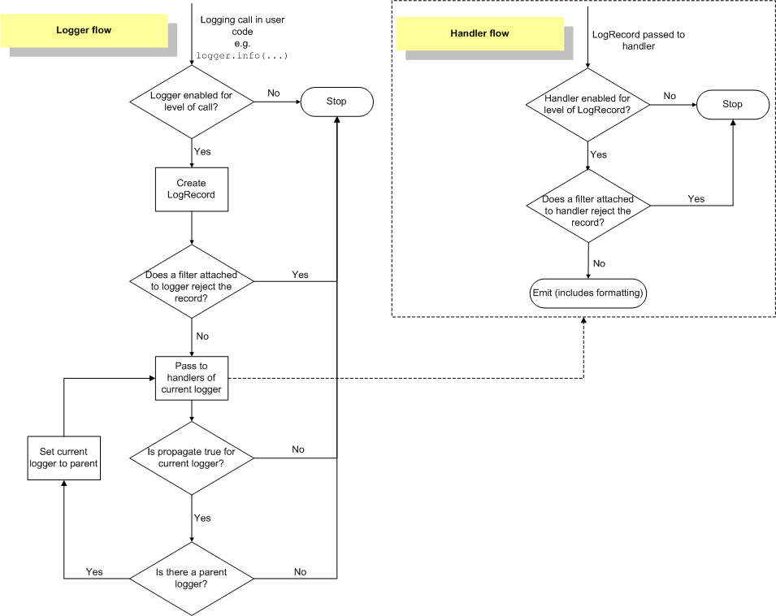

# Python

- [Python](#python)
  - [Basic Functions](#basic-functions)
    - [*How do you use int()*](#how-do-you-use-int)
  - [Building packages](#building-packages)
    - [*How are packages built?*](#how-are-packages-built)
    - [*How to distribute packages to pypi?*](#how-to-distribute-packages-to-pypi)
    - [*How to mark something as deprecated?*](#how-to-mark-something-as-deprecated)
  - [Logging](#logging)
    - [*How to configure logging?*](#how-to-configure-logging)
      - [Logging to a file](#logging-to-a-file)
      - [Changing the format of displayed messages](#changing-the-format-of-displayed-messages)
      - [Advanced Logging](#advanced-logging)
    - [*What is threading?*](#what-is-threading)
    - [*How to do HTTP requests in python?*](#how-to-do-http-requests-in-python)

---

## Basic Functions

### *How do you use int()*

---

## Building packages

---

### *How are packages built?*

### *How to distribute packages to pypi?*

### *How to mark something as deprecated?*

PendingDeprecationWarning

## Logging

---
<!-- markdownlint-disable MD013 -->
Logging is a means of tracking events that happen when some software runs. The software’s developer adds logging calls
to their code to indicate that certain events have occurred.

| Task you want to perform                                                      | The best tool for the task                                 |
| ----------------------------------------------------------------------------- | ---------------------------------------------------------- |
| Display console output for ordinary usage of a command line script or program | print()                                                    |
| Report events that occur during normal operation of a program                 | logging.info() (or logging.debug()                         |
| Issue a warning regarding a particular runtime event                          | warnings.warn()                                            |
| Report an error regarding a particular runtime event                          | Raise an exception                                         |
| Report suppression of an error without raising an exception                   | logging.error(), logging.exception() or logging.critical() |
<!-- markdownlint-enable MD013 -->

### *How to configure logging?*

#### Logging to a file

```python
import logging
logging.basicConfig(filename='example.log', encoding='utf-8', level=logging.DEBUG)
logging.debug('This message should go to the log file')
```

#### Changing the format of displayed messages

```python
logging.basicConfig(format='%(asctime)s-%(levelname)s:%(message)s', level=logging.DEBUG)
```

#### Advanced Logging

- Loggers expose the interface that application code directly uses.
- Handlers send the log records (created by loggers) to the appropriate destination.
- Filters provide a finer grained facility for determining which log records to output.
- Formatters specify the layout of log records in the final output.



Programmers can configure logging in three ways:

- Creating loggers, handlers, and formatters explicitly using Python code that calls the configuration methods listed above.
- Creating a logging config file and reading it using the fileConfig() function.
- Creating a dictionary of configuration information and passing it to the dictConfig() function

An example of a logging config file

```txt
[loggers]
keys=root,simpleExample

[handlers]
keys=consoleHandler

[formatters]
keys=simpleFormatter

[logger_root]
level=DEBUG
handlers=consoleHandler

[logger_simpleExample]
level=DEBUG
handlers=consoleHandler
qualname=simpleExample
propagate=0

[handler_consoleHandler]
class=StreamHandler
level=DEBUG
formatter=simpleFormatter
args=(sys.stdout,)

[formatter_simpleFormatter]
format=%(asctime)s - %(name)s - %(levelname)s - %(message)s
```

[Python's Official Logging Docs](https://docs.python.org/3/howto/logging.html#logging-basic-tutorial)

[Python's Logging Cookbook](https://docs.python.org/3/howto/logging-cookbook.html#logging-cookbook)

### *What is threading?*

[SuperFast Python- Threading: The complete guide](https://superfastpython.com/threading-in-python/)

### *How to do HTTP requests in python?*

[Requests package Docs](https://requests.readthedocs.io/en/latest/)
